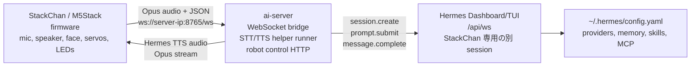
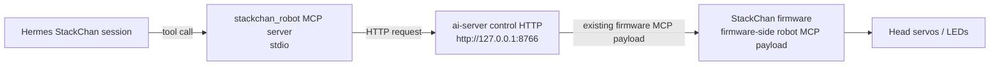

# StackChan Hermes Edition

[English README](./README.md)

このリポジトリは、StackChan を HermesAgent をバックエンドして使うためのものです。

M5Stack 実機は、マイク入力、スピーカー出力、顔表示、首サーボ、LED、タッチ、BLE Wi-Fi provisioning、自律モーションだけを担当します。STT、LLM、TTS、メモリ、スキル、MCP 判断などの処理は、サーバー端末で動かすことを想定しています。そのサーバー端末で HermesAgent と `ai-server` を同時に動かす仕組みです。

## この リポジトリ の役割

- StackChan は HermesAgent と音声で対話する物理インターフェースです。
- `ai-server` は M5Stack の WebSocket/Opus プロトコルと HermesAgent をつなぐ ブリッジ です。
- HermesAgent が STT、LLM、TTS、メモリ、スキル、provider 設定、MCP 設定を持ちます。
- StackChan firmware に必要なのは Wi-Fi と `ai-server` へ接続する `websocket_url` だけです。
- 意図的なロボット動作は Hermes から MCP tool として呼びます。瞬き、待機中の揺れ、発話中モーションは ファームウェア が自律制御します。

Hermes Agentで動作させることを前提に、フォーク元のM5Stackオリジナルリポジトリから、クラウド関連部分を削除しています。

## システム全体のしくみ




ロボット制御 tool は、サーバー端末内の別経路を使います。



v1 のロボット tool は以下です。

- `stackchan_get_status`: 完全な bridge URL や秘密情報を出さずに device 状態を読む。
- `stackchan_get_head_angles`: 現在の yaw / pitch を読む。
- `stackchan_set_head_angles`: 意図的な gesture として首を動かす。
- `stackchan_set_led_color`: onboard RGB LED を控えめな cue として設定する。
- `stackchan_power_off`: ユーザーが明示的に依頼したときに StackChan の電源を切る。
- `stackchan_take_photo`: カメラで静止画を撮る。
- `stackchan_display_image`: 画像を画面に preview 表示する。
- `stackchan_capture_screen`: 現在の画面を capture する。
- `stackchan_create_reminder`: 相対時間の local reminder を作る。
- `stackchan_get_reminders`: active な local reminder を一覧する。
- `stackchan_stop_reminder`: ID を指定して local reminder を停止する。

Hermes は、首振りや LED 変更などの意図的な動作だけをこれらの tool で指示します。自然な瞬き、待機モーション、発話中モーション、ローカル reminder 通知は ファームウェア が継続して担当します。カメラ、画面キャプチャ、画像表示、reminder tool は StackChan セッション用のローカル補助機能です。

## リポジトリ構成

- `firmware/`: StackChan 実機用 ESP32-S3 firmware。
- `ai-server/`: StackChan と HermesAgent を接続する TypeScript bridge。
- `hermes-agent/`: ローカルセットアップで使う HermesAgent checkout。
- `remote/`: ESP-NOW リモコン firmware。
- `app/`: Flutter app。BLE Wi-Fi provisioning client として使える場合がありますが、Hermes 音声ループには必須ではありません。
- `server/`: 既存 product stack の Go backend。ローカル Hermes 音声ループには必須ではありません。

## Desktop UI Simulator

M5Stack 実機へ flash する前に、firmware の avatar UI をデスクトップ上で確認できます。simulator は `firmware/tools/ui_sim/` 配下の standalone CMake project で、LVGL の `DefaultAvatar`、`BreathModifier`、`BlinkModifier` を再利用します。一方で、実機用 HAL、LCD、touch、servo、audio、camera、PMIC、ESP-IDF 初期化コードはリンクしません。

現在の保守対象は macOS です。headless mode は SDL に依存しないため、CMake と C++ compiler がある Unix 系環境へ移植しやすい構成ですが、macOS 以外の desktop 実行はまだ正式サポート扱いではありません。

headless smoke test:

```bash
./scripts/run-ui-sim.sh --headless \
  --scenario firmware/tools/ui_sim/scenarios/avatar_smoke.json \
  --screenshot /tmp/stackchan-ui-smoke.ppm
```

HERMES app 起動時の画面引き渡しを確認し、古い Launcher/HERMES 断片が消えた後に avatar の顔が実際に描画されることを assertion 付きで確認する:

```bash
./scripts/run-ui-sim.sh --headless \
  --scenario firmware/tools/ui_sim/scenarios/hermes_app_launch_regression.json \
  --screenshot /tmp/stackchan-ui-hermes-launch.ppm
```

SDL2 が使える Mac で 320x240 の visible window を開く:

```bash
./scripts/run-ui-sim.sh --scenario firmware/tools/ui_sim/scenarios/avatar_smoke.json
```

simulator には preview overlay、notification、app not-ready 画面、status/chat/emotion 遷移、lifecycle reset、overlay stacking の headless regression scenario もあります。scenario assertion で黒画面、顔 pixel の欠落、古い launcher 断片、画面外 bbox、overlay 表示状態の regression を検出できます。

script は `sudo`、`brew install`、global `pip install`、global npm install、shell profile 変更を行いません。build output と fallback dependency は `firmware/tools/ui_sim/build*` と `firmware/tools/ui_sim/.deps` に閉じ込めます。

依存関係、PPM screenshot の制約、troubleshooting、実機でしか確認できない項目は `firmware/tools/ui_sim/README.md` を参照してください。

## 用意するサーバー端末

StackChan と同じ LAN にあるPCやサーバーを使います。M5Stack からその端末の LAN IP に到達できる必要があります。

サーバー端末に必要なもの:

- `ai-server` 用の Node.js と npm
- HermesAgent helper module 用の Python 3
- TTS helper が WAV 以外を返した場合の音声変換に使う `ffmpeg`
- HermesAgent のインストール、またはこの repo 内の HermesAgent checkout
- StackChan から `ws://<server-ip>:8765/ws` へ接続できるネットワーク

標準設定で使う port:

| Port | Bind address | 用途 |
| --- | --- | --- |
| `8765` | server LAN interface | StackChan firmware が WebSocket 接続する |
| `8766` | `127.0.0.1` | MCP server から使う local robot control HTTP |
| `9119` | `127.0.0.1` | Hermes Dashboard/TUI `/api/ws` |

## Quick Start

### 1. Hermes Dashboard/TUI を起動する

`ai-server` と同じサーバー端末で Hermes を起動します。

```bash
hermes dashboard --tui --host 127.0.0.1 --port 9119
```

Hermes は Dashboard `/api/ws` が有効な状態で起動しておきます。`ai-server` はこの endpoint に接続し、StackChan 用の別 session を作ります。Dashboard/TUI で既に使っている別用途の active chat session は再利用せず、interrupt もしません。

### 2. `ai-server` を設定する

`ai-server/.env` を作成します。

```env
PORT=8765
STACKCHAN_CONTROL_PORT=8766
STACKCHAN_CONTROL_HOST=127.0.0.1
STACKCHAN_LOCAL_ONLY=true

HERMES_CONNECT_MODE=dashboard_ws
HERMES_DASHBOARD_URL=http://127.0.0.1:9119
HERMES_ROOT=../hermes-agent
HERMES_PYTHON=python3
HERMES_LOCAL_STT_LANGUAGE=ja

STACKCHAN_SILENCE_TIMEOUT_MS=1200
STACKCHAN_MAX_RECORDING_MS=15000
STACKCHAN_MIN_FRAMES_FOR_STT=10
STACKCHAN_POST_TTS_COOLDOWN_MS=1500
STACKCHAN_LOCAL_VAD_ENABLED=true
STACKCHAN_VAD_RMS_THRESHOLD=0.012
STACKCHAN_VAD_START_SPEECH_MS=120
STACKCHAN_VAD_END_SILENCE_MS=900
STACKCHAN_VAD_MIN_SPEECH_MS=240
STACKCHAN_VAD_PREROLL_MS=300
STACKCHAN_BARGE_IN_ENABLED=true
STACKCHAN_BARGE_IN_RMS_THRESHOLD=0.03
STACKCHAN_BARGE_IN_START_SPEECH_MS=180
STACKCHAN_BARGE_IN_MIN_SPEECH_MS=180
STACKCHAN_BARGE_IN_IGNORE_TTS_START_MS=300
STACKCHAN_MAX_SPEECH_CHARS=800
STACKCHAN_TTS_SEGMENT_MAX_CHARS=160
STACKCHAN_TTS_MAX_SEGMENTS=8
STACKCHAN_AUTO_LED_ENABLED=true
STACKCHAN_AUTO_LED_MANUAL_HOLD_MS=8000
```

`HERMES_ROOT` は、STT/TTS helper が import する HermesAgent の source tree または module root を指すようにします。
local VAD は default で有効です。`ai-server` が受信 Opus を 16 kHz mono PCM に decode し、軽量な RMS 判定で発話終了を検出します。そのため、端末が無音中も Opus frame を送り続ける場合でも、PCM 内容が無音なら turn を閉じられます。部屋がうるさい場合は `STACKCHAN_VAD_RMS_THRESHOLD` を上げます。発話末尾が切れる場合は `STACKCHAN_VAD_END_SILENCE_MS` を長くし、反応が遅い場合は短くします。`STACKCHAN_VAD_START_SPEECH_MS` と `STACKCHAN_VAD_PREROLL_MS` で開始判定の安定性と頭切れ防止量を調整できます。

barge-in は default で有効です。`ai-server` が TTS を stream している間だけ、通常より厳しめの RMS VAD でマイク Opus frame を見ます。ユーザーの発話が継続したら現在の TTS stream を止め、`tts stop` を一度だけ送り、StackChan 専用 Hermes session だけを interrupt して、すぐ listening に戻します。この機能は、TTS 再生中も firmware から mic Opus frame が届く場合に働きます。現在の xiaozhi speaking state は realtime listening / AEC mode でない場合に mic upload を止める可能性があるため、選択中の firmware mode で実機確認してください。TTS は文単位に分けて合成するため、長い返答でも全文合成を待たずに先頭文から再生を始められます。

自動 LED 状態表示も default で有効です。listening は控えめな緑、thinking は amber、speaking は控えめな青、idle は消灯です。Hermes が明示的に `stackchan_set_led_color` を呼んだ場合、その手動色を短時間優先してから自動状態表示に戻します。背景と移植範囲の詳細は [docs/robot-bridge-migration.md](./docs/robot-bridge-migration.md) を参照してください。

`STACKCHAN_LOCAL_ONLY=true` にすると StackChan 音声 loop を local-only にします。この場合、`HERMES_DASHBOARD_URL` は `localhost`、`127.0.0.1`、`::1`、`host.docker.internal` のいずれかに限定され、Hermes STT/TTS helper は cloud fallback を拒否します。STT は faster-whisper または `HERMES_LOCAL_STT_COMMAND`、TTS は Piper / KittenTTS / NeuTTS / command provider を使ってください。初回 model 取得や pip/npm install が事前 setup として必要な場合はありますが、実行時に cloud STT/TTS API へ逃がしません。

build して起動します。

```bash
cd ai-server
npm install
npm run build
npm start
```

StackChan から見た bridge URL は次の形です。

```text
ws://<server-ip>:8765/ws
```

設定値の参照表記: `websocket_url: ws://<server-ip>:8765/ws`

### 3. Hermes MCP robot tools を設定する

`~/.hermes/config.yaml` に StackChan robot MCP server を追加します。

```yaml
mcp_servers:
  stackchan_robot:
    command: node
    args:
      - /absolute/path/to/StackChan/ai-server/dist/stackchan_mcp_server.js
    env:
      STACKCHAN_CONTROL_URL: http://127.0.0.1:8766
```

設定を変更したら Hermes を再起動します。この MCP server は同じ端末上の `ai-server` control HTTP にだけ接続します。StackChan 実機が未接続の場合、Hermes の会話を落とさず、tool result として device-not-connected が返ります。

### 4. StackChan の SD card を設定する

StackChan の SD card に `/sdcard/config.json` を作成します。
サンプルは `firmware/sdcard/config.sample.json` にあります。

```json
{
  "websocket_url": "ws://<server-ip>:8765/ws",
  "websocket_version": 3,
  "wifi_ssid": "YOUR_2_4GHZ_WIFI_SSID",
  "wifi_password": "YOUR_WIFI_PASSWORD"
}
```

`<server-ip>` には、サーバー端末の LAN IP を入れます。`wifi_ssid` と `wifi_password` は任意です。指定した場合、`Load SD Config` 実行時に NVS に取り込み、ネットワーク設定済みとして扱います。空パスワードのネットワークでは `wifi_password` を空文字にできます。

Wi-Fi項目は `"wifi": {"ssid": "...", "password": "..."}` のネスト形式でも指定できます。

### 5. StackChan を起動する

未設定の初回起動時は `HERMES SETUP` が表示されます。Wi-Fi と bridge 設定が揃った後の起動では、標準設定では Launcher に留まり、HERMES は自動で開きません。`CONFIG_HERMES_AUTOSTART=y` を明示的に有効化した場合だけ自動で開きます。Hermes runtime を開始するには Launcher から `HERMES` app を選択してください。

主な状態表示:

- `Bridge URL missing`: SD/NVS から `websocket_url` が読めていません。
- `Wi-Fi not connected`: Wi-Fi provisioning が必要です。
- `Starting Hermes...` / `Connecting to Hermes bridge`: firmware が WebSocket runtime を起動中です。
- `Hermes bridge ready`: `ai-server` 経由で接続できています。
- `Check websocket_url and bridge host`: bridge host に到達できません。

BLE Wi-Fi provisioning は残っていますが、アカウント紐づけではなくネットワーク設定として扱います。画面には Device ID が表示され、provisioning client から Wi-Fi credentials を受け取るのを待ちます。

## 実行時の動作

音声の流れ:

1. StackChan がマイク音声を Opus frame として `ai-server` に送ります。
2. `ai-server` が受信 Opus を PCM に decode し、local RMS VAD で音声内容から発話終了を検出します。
3. `ai-server` が収集済み PCM を WAV として Hermes の STT helper module に渡します。
4. `ai-server` が transcript を Hermes Dashboard `/api/ws` の StackChan 専用 session に送ります。
5. Hermes がその session の最終応答 text を返します。
6. `ai-server` が発話 text を文単位の TTS segment に分け、segment ごとに Hermes の TTS helper module を Python subprocess で呼びます。
7. `ai-server` が各 segment の合成音声を Opus stream として順番に StackChan に返します。

interrupt の扱い:

- StackChan からの `abort` は、再生中の Opus stream を止めます。
- TTS streaming 中に届く mic Opus frame は barge-in 専用 VAD で decode され、ユーザー発話が続いた場合は現在の TTS stream を止め、StackChan 専用 Hermes session だけを interrupt します。
- barge-in は TTS 再生中も firmware が mic frame を送り続ける場合に有効です。firmware が再生中の mic input を止める場合、server 側だけでは検出できません。現在の xiaozhi speaking-state code は、選択中の listening / AEC mode で実機確認してください。
- `ai-server` は StackChan 用 Hermes session にだけ `session.interrupt` を送ります。
- Dashboard/TUI 側で別用途に使っている session は interrupt しません。

動きの制御:

- Hermes は MCP tool で意図的に首を動かしたり LED 色を変えたりできます。
- firmware は自律瞬き、待機モーション、発話中モーションを継続します。
- `ai-server` は Hermes の返答文から簡単な StackChan emotion を推定し、常に `neutral` にならないようにします。
- `ai-server` は listening / thinking / speaking / idle の控えめな LED 色を自動設定します。Hermes が明示的に LED tool を呼んだ場合は、その色を短時間優先します。
- この混合制御により、Hermes が細かい動作 frame を毎回制御しなくても自然なロボット動作を保てます。

## Firmware の設定

このリポジトリのHermes 専用 ファームウェア は、必要十分な 機能のみを残し、クラウド前提の画面を外しています。

Launcher に残る app:

- `HERMES`
- `DANCE`
- `ESPNOW.REMOTE`
- `SETUP`

Setup に残るもの:

- Version 表示
- Wi-Fi と BLE provisioning
- Device 情報
- Hermes bridge 設定
- Hardware test

ESP-IDF で build/flash します。

```bash
cd firmware
idf.py build
idf.py -p /dev/cu.usbmodemXXXX flash monitor
```

シリアルポートは、接続した M5Stack に対応するものを指定します。

## Troubleshooting

### Dashboard token または `/api/ws` error

Hermes を Dashboard/TUI 有効で起動してください。

```bash
hermes dashboard --tui --host 127.0.0.1 --port 9119
```

Dashboard HTML から session token を取得できない場合、利用中の Hermes setup で固定 token を扱えるときだけ `ai-server/.env` に `HERMES_DASHBOARD_TOKEN` を設定します。

### StackChan が接続できない

確認点:

- `ai-server` が起動している。
- M5Stack とサーバー端末が同じ LAN にいる。
- SD config にサーバー端末の LAN IP を入れている。
- firewall が inbound TCP port `8765` を許可している。
- URL が `/ws` で終わっている。

### Hermes は応答するが robot tools が失敗する

確認点:

- `ai-server` control server が `127.0.0.1:8766` で listen している。
- Hermes config の `STACKCHAN_CONTROL_URL` が `http://127.0.0.1:8766` になっている。
- `ai-server` 変更後に `npm run build` を実行している。
- StackChan 実機が `ai-server` に接続済み。

### STT/TTS helper failure

確認点:

- `HERMES_ROOT` が HermesAgent tree を指している。
- `HERMES_PYTHON` が Hermes tool module を import できる Python interpreter を指している。
- `ffmpeg` が install 済みで `PATH` から実行できる。
- `~/.hermes/config.yaml` の provider/audio tool 設定が有効。
- `STACKCHAN_LOCAL_ONLY=true` の場合、STT は faster-whisper または `local_command`、TTS は Piper / KittenTTS / NeuTTS / command provider にしてください。Edge TTS、OpenAI、Groq、ElevenLabs、MiniMax、xAI、Mistral、Gemini などへ fallback しません。

## 開発時の確認

変更後の推奨 check:

```bash
cd ai-server
npm run build
npm test
```

```bash
cd firmware
idf.py build
```

README の設定値確認:

```bash
rg "HERMES_CONNECT_MODE=dashboard_ws|HERMES_DASHBOARD_URL=http://127.0.0.1:9119|STACKCHAN_CONTROL_URL=http://127.0.0.1:8766|websocket_url: ws://<server-ip>:8765/ws" README.md README.ja.md
```

## ハードウェア安全上の注意

モーターが通電中または制御中か不明な状態で、可動部を手で無理に回さないでください。ハードウェア破損の原因になります。

ベースハードウェアの製品ドキュメント:

- [English](https://docs.m5stack.com/en/StackChan)
- [日本語](https://docs.m5stack.com/ja/StackChan)
- [中文](https://docs.m5stack.com/zh_CN/StackChan)
