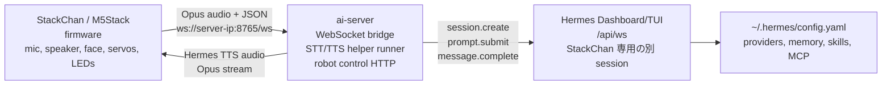
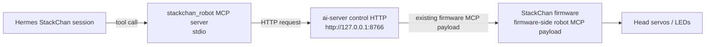

# StackChan Hermes Edition

[English README](./README.md)

このリポジトリは、StackChan を HermesAgent をバックエンドして使うためのものです。

M5Stack 実機は、マイク入力、スピーカー出力、顔表示、首サーボ、LED、タッチ、BLE Wi-Fi provisioning、自律モーションだけを担当します。STT、LLM、TTS、メモリ、スキル、MCP 判断などの処理は、サーバー端末で動かすことを想定しています。そのサーバー端末で HermesAgent と `ai-server` を同時に動かす仕組みです。

## この リポジトリ の役割

- StackChan は HermesAgent と音声で対話する物理インターフェースです。
- `ai-server` は M5Stack の WebSocket/Opus プロトコルと HermesAgent をつなぐ ブリッジ です。
- HermesAgent が STT、LLM、TTS、メモリ、スキル、provider 設定、MCP 設定を持ちます。
- StackChan firmware に必要なのは Wi-Fi と `ai-server` へ接続する `websocket_url` だけです。
- 意図的なロボット動作は Hermes から MCP tool として呼びます。瞬き、待機中の揺れ、発話中モーションは ファームウェア が自律制御します。

Hermes Agentで動作させることを前提に、フォーク元のM5Stackオリジナルリポジトリから、クラウド関連部分を削除しています。

## システム全体のしくみ




ロボット制御 tool は、サーバー端末内の別経路を使います。



v1 のロボット tool は以下です。

- `stackchan_get_head_angles`
- `stackchan_set_head_angles`
- `stackchan_set_led_color`

Hermes は、首振りや LED 変更などの意図的な動作だけをこれらの tool で指示します。自然な瞬き、待機モーション、発話中モーションは ファームウェア が継続して担当します。

## リポジトリ構成

- `firmware/`: StackChan 実機用 ESP32-S3 firmware。
- `ai-server/`: StackChan と HermesAgent を接続する TypeScript bridge。
- `hermes-agent/`: ローカルセットアップで使う HermesAgent checkout。
- `remote/`: ESP-NOW リモコン firmware。
- `app/`: Flutter app。BLE Wi-Fi provisioning client として使える場合がありますが、Hermes 音声ループには必須ではありません。
- `server/`: 既存 product stack の Go backend。ローカル Hermes 音声ループには必須ではありません。

## 用意するサーバー端末

StackChan と同じ LAN にあるPCやサーバーを使います。M5Stack からその端末の LAN IP に到達できる必要があります。

サーバー端末に必要なもの:

- `ai-server` 用の Node.js と npm
- HermesAgent helper module 用の Python 3
- TTS helper が WAV 以外を返した場合の音声変換に使う `ffmpeg`
- HermesAgent のインストール、またはこの repo 内の HermesAgent checkout
- StackChan から `ws://<server-ip>:8765/ws` へ接続できるネットワーク

標準設定で使う port:

| Port | Bind address | 用途 |
| --- | --- | --- |
| `8765` | server LAN interface | StackChan firmware が WebSocket 接続する |
| `8766` | `127.0.0.1` | MCP server から使う local robot control HTTP |
| `9119` | `127.0.0.1` | Hermes Dashboard/TUI `/api/ws` |

## Quick Start

### 1. Hermes Dashboard/TUI を起動する

`ai-server` と同じサーバー端末で Hermes を起動します。

```bash
hermes dashboard --tui --host 127.0.0.1 --port 9119
```

Hermes は Dashboard `/api/ws` が有効な状態で起動しておきます。`ai-server` はこの endpoint に接続し、StackChan 用の別 session を作ります。Dashboard/TUI で既に使っている別用途の active chat session は再利用せず、interrupt もしません。

### 2. `ai-server` を設定する

`ai-server/.env` を作成します。

```env
PORT=8765
STACKCHAN_CONTROL_PORT=8766
STACKCHAN_CONTROL_HOST=127.0.0.1

HERMES_CONNECT_MODE=dashboard_ws
HERMES_DASHBOARD_URL=http://127.0.0.1:9119
HERMES_ROOT=../hermes-agent
HERMES_PYTHON=python3
```

`HERMES_ROOT` は、STT/TTS helper が import する HermesAgent の source tree または module root を指すようにします。

build して起動します。

```bash
cd ai-server
npm install
npm run build
npm start
```

StackChan から見た bridge URL は次の形です。

```text
ws://<server-ip>:8765/ws
```

設定値の参照表記: `websocket_url: ws://<server-ip>:8765/ws`

### 3. Hermes MCP robot tools を設定する

`~/.hermes/config.yaml` に StackChan robot MCP server を追加します。

```yaml
mcp_servers:
  stackchan_robot:
    command: node
    args:
      - /absolute/path/to/StackChan/ai-server/dist/stackchan_mcp_server.js
    env:
      STACKCHAN_CONTROL_URL: http://127.0.0.1:8766
```

設定を変更したら Hermes を再起動します。この MCP server は同じ端末上の `ai-server` control HTTP にだけ接続します。StackChan 実機が未接続の場合、Hermes の会話を落とさず、tool result として device-not-connected が返ります。

### 4. StackChan の SD card を設定する

StackChan の SD card に `/sdcard/config.json` を作成します。
サンプルは `firmware/sdcard/config.sample.json` にあります。

```json
{
  "websocket_url": "ws://<server-ip>:8765/ws",
  "websocket_version": 3
}
```

`<server-ip>` には、サーバー端末の LAN IP を入れます。

Hermes 専用 firmware が SD config から読むのは、この 2 つの key だけです。

### 5. StackChan を起動する

初回起動時は `HERMES SETUP` が表示されます。

主な状態表示:

- `Bridge URL missing`: SD/NVS から `websocket_url` が読めていません。
- `Wi-Fi not connected`: Wi-Fi provisioning が必要です。
- `Connecting to Hermes bridge`: firmware が WebSocket runtime を起動中です。
- `Hermes bridge ready`: `ai-server` 経由で接続できています。
- `Check websocket_url and bridge host`: bridge host に到達できません。

BLE Wi-Fi provisioning は残っていますが、アカウント紐づけではなくネットワーク設定として扱います。画面には Device ID が表示され、provisioning client から Wi-Fi credentials を受け取るのを待ちます。

## 実行時の動作

音声の流れ:

1. StackChan がマイク音声を Opus frame として `ai-server` に送ります。
2. `ai-server` が音声を decode し、Hermes の STT helper module を Python subprocess で呼びます。
3. `ai-server` が transcript を Hermes Dashboard `/api/ws` の StackChan 専用 session に送ります。
4. Hermes がその session の最終応答 text を返します。
5. `ai-server` が Hermes の TTS helper module を Python subprocess で呼びます。
6. `ai-server` が合成音声を Opus stream として StackChan に返します。

interrupt の扱い:

- StackChan からの `abort` は、再生中の Opus stream を止めます。
- `ai-server` は StackChan 用 Hermes session にだけ `session.interrupt` を送ります。
- Dashboard/TUI 側で別用途に使っている session は interrupt しません。

動きの制御:

- Hermes は MCP tool で意図的に首を動かしたり LED 色を変えたりできます。
- firmware は自律瞬き、待機モーション、発話中モーションを継続します。
- この混合制御により、Hermes が細かい動作 frame を毎回制御しなくても自然なロボット動作を保てます。

## Firmware の設定

このリポジトリのHermes 専用 ファームウェア は、必要十分な 機能のみを残し、クラウド前提の画面を外しています。

Launcher に残る app:

- `HERMES`
- `DANCE`
- `ESPNOW.REMOTE`
- `SETUP`

Setup に残るもの:

- Version 表示
- Wi-Fi と BLE provisioning
- Device 情報
- Hermes bridge 設定
- Hardware test

ESP-IDF で build/flash します。

```bash
cd firmware
idf.py build
idf.py -p /dev/cu.usbmodemXXXX flash monitor
```

シリアルポートは、接続した M5Stack に対応するものを指定します。

## Troubleshooting

### Dashboard token または `/api/ws` error

Hermes を Dashboard/TUI 有効で起動してください。

```bash
hermes dashboard --tui --host 127.0.0.1 --port 9119
```

Dashboard HTML から session token を取得できない場合、利用中の Hermes setup で固定 token を扱えるときだけ `ai-server/.env` に `HERMES_DASHBOARD_TOKEN` を設定します。

### StackChan が接続できない

確認点:

- `ai-server` が起動している。
- M5Stack とサーバー端末が同じ LAN にいる。
- SD config にサーバー端末の LAN IP を入れている。
- firewall が inbound TCP port `8765` を許可している。
- URL が `/ws` で終わっている。

### Hermes は応答するが robot tools が失敗する

確認点:

- `ai-server` control server が `127.0.0.1:8766` で listen している。
- Hermes config の `STACKCHAN_CONTROL_URL` が `http://127.0.0.1:8766` になっている。
- `ai-server` 変更後に `npm run build` を実行している。
- StackChan 実機が `ai-server` に接続済み。

### STT/TTS helper failure

確認点:

- `HERMES_ROOT` が HermesAgent tree を指している。
- `HERMES_PYTHON` が Hermes tool module を import できる Python interpreter を指している。
- `ffmpeg` が install 済みで `PATH` から実行できる。
- `~/.hermes/config.yaml` の provider/audio tool 設定が有効。

## 開発時の確認

変更後の推奨 check:

```bash
cd ai-server
npm run build
npm test
```

```bash
cd firmware
idf.py build
```

README の設定値確認:

```bash
rg "HERMES_CONNECT_MODE=dashboard_ws|HERMES_DASHBOARD_URL=http://127.0.0.1:9119|STACKCHAN_CONTROL_URL=http://127.0.0.1:8766|websocket_url: ws://<server-ip>:8765/ws" README.md README.ja.md
```

## ハードウェア安全上の注意

モーターが通電中または制御中か不明な状態で、可動部を手で無理に回さないでください。ハードウェア破損の原因になります。

ベースハードウェアの製品ドキュメント:

- [English](https://docs.m5stack.com/en/StackChan)
- [日本語](https://docs.m5stack.com/ja/StackChan)
- [中文](https://docs.m5stack.com/zh_CN/StackChan)
