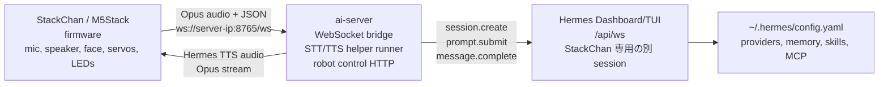
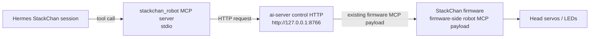

# StackChan Hermes Edition

[English README](./README.md)

このリポジトリは、StackChan を HermesAgent をバックエンドして使うためのものです。

M5Stack 実機は、マイク入力、スピーカー出力、顔表示、首サーボ、LED、タッチ、BLE Wi-Fi provisioning、自律モーションだけを担当します。STT、LLM、TTS、メモリ、スキル、MCP 判断などの処理は、サーバー端末で動かすことを想定しています。そのサーバー端末で HermesAgent と `ai-server` を同時に動かす仕組みです。

## この リポジトリ の役割

- StackChan は HermesAgent と音声で対話する物理インターフェースです。
- `ai-server` は M5Stack の WebSocket/Opus プロトコルと HermesAgent をつなぐ ブリッジ です。
- HermesAgent が STT、LLM、TTS、メモリ、スキル、provider 設定、MCP 設定を持ちます。
- StackChan firmware に必要なのは Wi-Fi と `ai-server` へ接続する `websocket_url` だけです。
- 意図的なロボット動作は Hermes から MCP tool として呼びます。瞬き、待機中の揺れ、発話中モーションは ファームウェア が自律制御します。

Hermes Agentで動作させることを前提に、フォーク元のM5Stackオリジナルリポジトリから、クラウド関連部分を削除しています。

## システム全体のしくみ



```mermaid
flowchart LR
    M5["StackChan / M5Stack\nfirmware\nmic, speaker, face, servos, LEDs"]
    Bridge["ai-server\nWebSocket bridge\nSTT/TTS helper runner\nrobot control HTTP"]
    Hermes["Hermes Dashboard/TUI\n/api/ws\nStackChan 専用の別 session"]
    Config["~/.hermes/config.yaml\nproviders, memory, skills, MCP"]

    M5 -- "Opus audio + JSON\nws://server-ip:8765/ws" --> Bridge
    Bridge -- "session.create\nprompt.submit\nmessage.complete" --> Hermes
    Hermes --> Config
    Bridge -- "Hermes TTS audio\nOpus stream" --> M5
```

ロボット制御 tool は、サーバー端末内の別経路を使います。


```mermaid
flowchart LR
    Hermes["Hermes StackChan session"]
    MCP["stackchan_robot MCP server\nstdio"]
    Control["ai-server control HTTP\nhttp://127.0.0.1:8766"]
    Firmware["StackChan firmware\nfirmware-side robot MCP payload"]
    Body["Head servos / LEDs"]

    Hermes -- "tool call" --> MCP
    MCP -- "HTTP request" --> Control
    Control -- "existing firmware MCP payload" --> Firmware
    Firmware --> Body
```

v1 のロボット tool は以下です。

- `stackchan_get_status`: 完全な bridge URL や秘密情報を出さずに device 状態を読む。
- `stackchan_set_speaker_volume`: 物理スピーカー音量を一時的または永続的に設定する。
- `stackchan_play_test_tone`: Hermes/TTS/Opus を通さず、M5 スピーカーで短い診断トーンを鳴らす。
- `stackchan_get_head_angles`: 現在の yaw / pitch を読む。
- `stackchan_set_head_angles`: 意図的な gesture として首を動かす。
- `stackchan_set_led_color`: onboard RGB LED を控えめな cue として設定する。
- `stackchan_power_off`: ユーザーが明示的に依頼したときに StackChan の電源を切る。
- `stackchan_take_photo`: カメラで静止画を撮る。
- `stackchan_display_image`: 画像を画面に preview 表示する。
- `stackchan_capture_screen`: 現在の画面を capture する。
- `stackchan_ask_hermes_subagent`: 時間のかかる調査、コード確認、長い推論などをバックグラウンドの Hermes sub-agent に委譲し、先に短い acknowledgement を返す。
- `stackchan_create_reminder`: 相対時間の local reminder を作る。
- `stackchan_get_reminders`: active な local reminder を一覧する。
- `stackchan_stop_reminder`: ID を指定して local reminder を停止する。

Hermes は、首振りや LED 変更などの意図的な動作だけをこれらの tool で指示します。自然な瞬き、待機モーション、発話中モーション、ローカル reminder 通知は ファームウェア が継続して担当します。カメラ、画面キャプチャ、画像表示、reminder tool は StackChan セッション用のローカル補助機能です。

## リポジトリ構成

- `firmware/`: StackChan 実機用 ESP32-S3 firmware。
- `ai-server/`: StackChan と HermesAgent を接続する TypeScript bridge。
- `hermes-agent/`: ローカルセットアップで使う HermesAgent checkout。
- `remote/`: ESP-NOW リモコン firmware。
- `app/`: Flutter app。BLE Wi-Fi provisioning client として使える場合がありますが、Hermes 音声ループには必須ではありません。
- `server/`: 既存 product stack の Go backend。ローカル Hermes 音声ループには必須ではありません。

## Desktop UI Simulator

M5Stack 実機へ flash する前に、firmware の avatar UI をデスクトップ上で確認できます。simulator は `firmware/tools/ui_sim/` 配下の standalone CMake project で、LVGL の `DefaultAvatar`、`BreathModifier`、`BlinkModifier` を再利用します。一方で、実機用 HAL、LCD、touch、servo、audio、camera、PMIC、ESP-IDF 初期化コードはリンクしません。

現在の保守対象は macOS です。headless mode は SDL に依存しないため、CMake と C++ compiler がある Unix 系環境へ移植しやすい構成ですが、macOS 以外の desktop 実行はまだ正式サポート扱いではありません。

headless smoke test:

```bash
./scripts/run-ui-sim.sh --headless \
  --scenario firmware/tools/ui_sim/scenarios/avatar_smoke.json \
  --screenshot /tmp/stackchan-ui-smoke.ppm
```

HERMES app 起動時の画面引き渡しを確認し、古い Launcher/HERMES 断片が消えた後に avatar の顔が実際に描画されることを assertion 付きで確認する:

```bash
./scripts/run-ui-sim.sh --headless \
  --scenario firmware/tools/ui_sim/scenarios/hermes_app_launch_regression.json \
  --screenshot /tmp/stackchan-ui-hermes-launch.ppm
```

SDL2 が使える Mac で 320x240 の visible window を開く:

```bash
./scripts/run-ui-sim.sh --scenario firmware/tools/ui_sim/scenarios/avatar_smoke.json
```

simulator には preview overlay、notification、app not-ready 画面、status/chat/emotion 遷移、lifecycle reset、overlay stacking の headless regression scenario もあります。scenario assertion で黒画面、顔 pixel の欠落、古い launcher 断片、画面外 bbox、overlay 表示状態の regression を検出できます。

script は `sudo`、`brew install`、global `pip install`、global npm install、shell profile 変更を行いません。build output と fallback dependency は `firmware/tools/ui_sim/build*` と `firmware/tools/ui_sim/.deps` に閉じ込めます。

依存関係、PPM screenshot の制約、troubleshooting、実機でしか確認できない項目は `firmware/tools/ui_sim/README.md` を参照してください。

## 用意するサーバー端末

StackChan と同じ LAN にあるPCやサーバーを使います。M5Stack からその端末の LAN IP に到達できる必要があります。

サーバー端末に必要なもの:

- `ai-server` 用の Node.js と npm
- HermesAgent helper module 用の Python 3
- TTS helper が WAV 以外を返した場合の音声変換に使う `ffmpeg`
- HermesAgent のインストール、またはこの repo 内の HermesAgent checkout
- StackChan から `ws://<server-ip>:8765/ws` へ接続できるネットワーク

標準設定で使う port:

| Port | Bind address | 用途 |
| --- | --- | --- |
| `8765` | server LAN interface | StackChan firmware が WebSocket 接続する |
| `8766` | `127.0.0.1` | MCP server から使う local robot control HTTP |
| `9119` | `127.0.0.1` | Hermes Dashboard/TUI `/api/ws` |

## Quick Start

### 1. Hermes Dashboard/TUI を起動する

`ai-server` と同じサーバー端末で Hermes を起動します。

```bash
hermes dashboard --tui --host 127.0.0.1 --port 9119
```

Hermes は Dashboard `/api/ws` が有効な状態で起動しておきます。`ai-server` はこの endpoint に接続し、StackChan 用の別 session を作ります。Dashboard/TUI で既に使っている別用途の active chat session は再利用せず、interrupt もしません。

### 2. `ai-server` を設定する

`ai-server/.env` を作成します。

```env
PORT=8765
STACKCHAN_CONTROL_PORT=8766
STACKCHAN_CONTROL_HOST=127.0.0.1
STACKCHAN_LOCAL_ONLY=true

HERMES_CONNECT_MODE=dashboard_ws
HERMES_DASHBOARD_URL=http://127.0.0.1:9119
STACKCHAN_HERMES_WARMUP_ENABLED=false
STACKCHAN_HERMES_WARMUP_TIMEOUT_MS=20000
HERMES_ROOT=../hermes-agent
HERMES_PYTHON=python3
HERMES_LOCAL_STT_LANGUAGE=ja
STACKCHAN_LOCAL_TTS_URL=http://127.0.0.1:18002/?language=ja
STACKCHAN_LOCAL_TTS_TIMEOUT_MS=15000
STACKCHAN_LOCAL_TTS_OUTPUT_ENABLED=false
STACKCHAN_LOCAL_TTS_OUTPUT_TARGET_NAME=JBL Flip 3
STACKCHAN_LOCAL_TTS_OUTPUT_VOLUME=0.35
STACKCHAN_LOCAL_TTS_FALLBACK_M5_VOLUME=62

STACKCHAN_SILENCE_TIMEOUT_MS=1200
STACKCHAN_MAX_RECORDING_MS=15000
STACKCHAN_MIN_FRAMES_FOR_STT=10
STACKCHAN_POST_TTS_COOLDOWN_MS=1000
STACKCHAN_LOCAL_VAD_ENABLED=true
STACKCHAN_VAD_RMS_THRESHOLD=0.025
STACKCHAN_VAD_START_SPEECH_MS=60
STACKCHAN_VAD_END_SILENCE_MS=650
STACKCHAN_VAD_MIN_SPEECH_MS=240
STACKCHAN_VAD_PREROLL_MS=360
STACKCHAN_BARGE_IN_ENABLED=false
STACKCHAN_BARGE_IN_RMS_THRESHOLD=0.75
STACKCHAN_BARGE_IN_START_SPEECH_MS=360
STACKCHAN_BARGE_IN_MIN_SPEECH_MS=420
STACKCHAN_BARGE_IN_IGNORE_TTS_START_MS=1800
STACKCHAN_MAX_SPEECH_CHARS=28
STACKCHAN_TTS_SEGMENT_MAX_CHARS=28
STACKCHAN_TTS_MAX_SEGMENTS=1
STACKCHAN_TTS_PREROLL_MS=600
STACKCHAN_TTS_OUTPUT_GAIN=0.65
STACKCHAN_OPUS_PCM_INPUT=buffer
STACKCHAN_MAX_DURATION_STT_RMS_THRESHOLD=0.006
STACKCHAN_FAST_ACK_ENABLED=true
STACKCHAN_FAST_ACK_TEXT=はい。
STACKCHAN_FAST_ACK_TEXTS=はい。|うん。|了解。|なるほど。|わかった。|OK。
STACKCHAN_STOP_LLM_AFTER_MAX_SPOKEN_SEGMENTS=true
STACKCHAN_REPLY_PROMPT_PREFIX=音声会話です。原則1文・14文字以内で短く自然に返して。長さ指定が聞こえても、長く話し続けず必要なら「もう一度。」だけ返して。冗長にしない。
STACKCHAN_AUTO_LED_ENABLED=true
STACKCHAN_AUTO_LED_MANUAL_HOLD_MS=8000
```

`HERMES_ROOT` は、STT/TTS helper が import する HermesAgent の source tree または module root を指すようにします。`STACKCHAN_LOCAL_TTS_URL` を設定すると、`ai-server` はUTF-8テキストを常駐ローカルendpointへ直接POSTし、WAV応答を受け取ります。segmentごとのHermes/Python helper起動がなくなります。Piper Plusの `piper.http_server` はこの経路と互換です。
`STACKCHAN_LOCAL_TTS_OUTPUT_ENABLED=true` にすると、`ai-server` は TTS turn ごとに指定名の PipeWire sink を探します。接続中ならホスト側スピーカーから発話し、その間だけM5スピーカーをmuteします。M5には同期用のOpus frameを送り続けるため、顔と発話状態は連動します。sinkが見つからない、または初期化に失敗した場合は `STACKCHAN_LOCAL_TTS_FALLBACK_M5_VOLUME` のM5内蔵スピーカーへ自動フォールバックします。BluetoothスピーカーをStackChan背後に置く構成で有効です。
常時稼働の低スペック端末では `STACKCHAN_HERMES_WARMUP_ENABLED=true` にすると、device WebSocket listenerを開く前に最小限の非表示プロンプトを1回送ります。providerのcold start待ちをservice起動時へ移せます。待機は `STACKCHAN_HERMES_WARMUP_TIMEOUT_MS` で上限を設け、失敗しても `ai-server` 自体は起動します。
local VAD は低遅延の M5Stack 経路で default on です。入力 Opus は session ごとの disposable decoder で復号し、一時的な decode 失敗では decoder を作り直します。連続失敗した場合だけ arrival-gap timeout に退避するため、1つの壊れた frame が TTS encoder まで巻き込む状態を避けます。`STACKCHAN_VAD_END_SILENCE_MS` は遅延と早切れの主な調整点で、自然な日本語会話では 600-750 ms 程度が実用範囲です。

barge-in は、M5 マイクが自分のスピーカーを拾いやすい物理音響経路のため default off のままです。TTS は文単位に分けて合成するため、長い返答でも全文合成を待たずに先頭文から再生を始められます。`STACKCHAN_STOP_LLM_AFTER_MAX_SPOKEN_SEGMENTS` は発話セグメント上限に達した時点で専用 Hermes stream を interrupt し、長さ指定の聞き違いで音声 loop が長時間占有されるのを防ぎます。`STACKCHAN_TTS_PREROLL_MS` は最初の有声音声 frame の前に無音 Opus を送って、実機スピーカーで冒頭音節が欠けるのを避けるための設定です。実機スピーカーの立ち上がりで頭が欠ける場合は 450-600 ms 程度が調整範囲です。`STACKCHAN_TTS_OUTPUT_GAIN` は Opus encode 前の合成音声 PCM を下げ、小型 M5Stack スピーカーでの音割れを避けるための設定です。`STACKCHAN_OPUS_PCM_INPUT=buffer` は guarded OpusScript heap-copy encoder を使います。`int16` は legacy public OpusScript encode path の実機 A/B 診断用にだけ使ってください。`STACKCHAN_MAX_DURATION_STT_RMS_THRESHOLD` は非常に小さい音量の最長録音 fallback を STT 前に捨て、無音 hallucination が誤返答になるのを防ぎます。`STACKCHAN_FAST_ACK_TEXTS` は複数の短い相づちを事前キャッシュし、STT直後にランダムに再生することで毎回同じ第一声になるのを避けます。

自動 LED 状態表示も default で有効です。listening は控えめな緑、thinking は amber、speaking は控えめな青、idle は消灯です。Hermes が明示的に `stackchan_set_led_color` を呼んだ場合、その手動色を短時間優先してから自動状態表示に戻します。背景と移植範囲の詳細は [docs/robot-bridge-migration.md](./docs/robot-bridge-migration.md) を参照してください。

`STACKCHAN_LOCAL_ONLY=true` にすると StackChan 音声 loop を local-only にします。この場合、`HERMES_DASHBOARD_URL` は `localhost`、`127.0.0.1`、`::1`、`host.docker.internal` のいずれかに限定され、Hermes STT/TTS helper は cloud fallback を拒否します。STT は `HERMES_STT_URL` を ReazonSpeech などのローカルOpenAI互換endpointへ向けるか、faster-whisper / `HERMES_LOCAL_STT_COMMAND` を使います。TTS は `STACKCHAN_LOCAL_TTS_URL` を Piper Plus などのローカルWAV endpointへ向けてください。初回 model 取得や pip/npm install が事前 setup として必要な場合はありますが、実行時に cloud STT/TTS API へ逃がしません。

JBL から M5 へ音声を入れる実機 probe を走らせる前に、ホスト側の音声経路を確認してください。

```bash
cd ai-server
npm run probe:voice -- --preflight
```

preflight は bridge readiness、JBL の PipeWire sink、USB カメラマイク source、ALSA `/dev/snd` access、Bluetooth 接続状態を確認します。probe の録音と report は `ai-server/probe-runs/` に保存され、このディレクトリは git 管理対象外です。

build して起動します。

```bash
cd ai-server
npm install
npm run build
npm start
```

StackChan から見た bridge URL は次の形です。

```text
ws://<server-ip>:8765/ws
```

設定値の参照表記: `websocket_url: ws://<server-ip>:8765/ws`

### 3. Hermes MCP robot tools を設定する

`~/.hermes/config.yaml` に StackChan robot MCP server を追加します。

```yaml
mcp_servers:
  stackchan_robot:
    command: node
    args:
      - /absolute/path/to/StackChan/ai-server/dist/stackchan_mcp_server.js
    env:
      STACKCHAN_CONTROL_URL: http://127.0.0.1:8766
      HERMES_CONNECT_MODE: dashboard_ws
      HERMES_DASHBOARD_URL: http://127.0.0.1:9119
      HERMES_ROOT: /absolute/path/to/hermes-agent
      HERMES_PYTHON: python3
```

設定を変更したら Hermes を再起動します。この MCP server は同じ端末上の `ai-server` control HTTP にだけ接続します。StackChan 実機が未接続の場合、Hermes の会話を落とさず、tool result として device-not-connected が返ります。

`stackchan_ask_hermes_subagent` は高速応答用の任意 tool です。前面の Hermes がこの tool を呼ぶと、tool result はすぐ返り、前面の Hermes は「確認するね」のような短い返答を先に発話できます。バックグラウンドの Hermes sub-agent が完了すると、`ai-server` の `/internal/followup` に結果を戻し、現在の StackChan セッションが空いたタイミングで続報として読み上げます。sub-agent の起動を軽くするため、可能なら `HERMES_CONNECT_MODE: dashboard_ws` を使って既存の Hermes Dashboard に接続してください。

### 4. StackChan の SD card を設定する

StackChan の SD card に `/sdcard/config.json` を作成します。
サンプルは `firmware/sdcard/config.sample.json` にあります。

```json
{
  "websocket_url": "ws://<server-ip>:8765/ws",
  "websocket_version": 3,
  "wifi_ssid": "YOUR_2_4GHZ_WIFI_SSID",
  "wifi_password": "YOUR_WIFI_PASSWORD"
}
```

`<server-ip>` には、サーバー端末の LAN IP を入れます。`wifi_ssid` と `wifi_password` は任意です。指定した場合、`Load SD Config` 実行時に NVS に取り込み、ネットワーク設定済みとして扱います。空パスワードのネットワークでは `wifi_password` を空文字にできます。

SD card 上の `config.json` を書き換えただけでは、firmware が使用中の設定は更新されません。`ai-server` の接続先を変える場合は、`websocket_url` を編集した後、`SETUP` > `Hermes` > `Load SD Config` を再実行し、2 回の自動再起動が終わるまで待ってください。有効な `ws://` または `wss://` の `websocket_url` は NVS に保存済みの WebSocket URL を上書きします。空、未指定、不正な scheme、長すぎる値は skip され、以前保存された URL が引き続き使われます。

firmware は通常起動時や HERMES を開いた時には SD config を自動 import しません。CoreS3 / StackChan では SD card と LCD が SPI/GPIO35 を共有しているため、SD import は明示的な `SETUP` > `Hermes` > `Load SD Config` フローに限定しています。このフローでは、先に再起動し、LCD 初期化前に SD config を import してから、もう一度通常起動へ再起動します。

Wi-Fi項目は `"wifi": {"ssid": "...", "password": "..."}` のネスト形式でも指定できます。

### 5. StackChan を起動する

未設定の初回起動時は `HERMES SETUP` が表示されます。SD config を使う場合は、いったん Launcher に進み、`SETUP` > `Hermes` > `Load SD Config` を一度実行し、2 回の自動再起動が終わってから HERMES を開いてください。Wi-Fi と bridge 設定が揃った後の起動では、標準設定では Launcher に留まり、HERMES は自動で開きません。`CONFIG_HERMES_AUTOSTART=y` を明示的に有効化した場合だけ自動で開きます。Hermes runtime を開始するには Launcher から `HERMES` app を選択してください。

Mooncake app と HERMES 未準備画面では、画面下端から上へスワイプすると Home ボタンが表示され、押すと Launcher に戻ります。Hermes runtime 起動後も同じ下端スワイプで Home ボタンを表示しますが、Mooncake はすでに破棄済みのため、ボタンを押すと本体を再起動して Launcher に戻ります。

主な状態表示:

- `Bridge URL missing`: NVS に `websocket_url` がありません。`Load SD Config` または別の設定導線で設定してください。
- `Wi-Fi not connected`: Wi-Fi provisioning が必要です。
- `Starting Hermes...` / `Connecting to Hermes bridge`: firmware が WebSocket runtime を起動中です。
- `Hermes bridge ready`: `ai-server` 経由で接続できています。
- `Check websocket_url and bridge host`: bridge host に到達できません。

HERMES を手動で開いた後に WebSocket が予期せず切れた場合、firmware は 1、2、4、…、最大30秒の指数バックオフで自動再接続します。意図的な切断、Launcher への復帰、protocol reset では再試行を解除します。これにより `ai-server` の再起動後も、本体再起動やHERMESの開き直しなしで復帰できます。

BLE Wi-Fi provisioning は残っていますが、アカウント紐づけではなくネットワーク設定として扱います。画面には Device ID が表示され、provisioning client から Wi-Fi credentials を受け取るのを待ちます。

## 実行時の動作

音声の流れ:

1. StackChan がマイク音声を Opus frame として `ai-server` に送ります。
2. `ai-server` が受信 Opus を PCM に decode し、local RMS VAD で音声内容から発話終了を検出します。
3. `ai-server` が収集済み PCM を WAV として、設定済みの OpenAI互換ローカルSTT endpointへ直接送ります。endpoint未設定時は Hermes のPython helperへフォールバックします。
4. `ai-server` が transcript を Hermes Dashboard `/api/ws` の StackChan 専用 session に送ります。
5. Hermes がその session の最終応答 text を返します。
6. `ai-server` が発話 text を文単位の TTS segment に分け、設定済みの常駐ローカルTTS endpointへ各segmentを直接POSTします。endpoint未設定時は Hermes のPython helperへフォールバックします。
7. `ai-server` が各 segment の合成音声を Opus stream として順番に StackChan に返します。local TTS outputを有効にした場合、可聴音声は指定PipeWireスピーカーから出し、同じ時間軸のstreamでM5 avatarを同期します。local sinkが使えなければM5スピーカーへ戻ります。

interrupt の扱い:

- StackChan からの `abort` は、再生中の Opus stream を止めます。
- TTS streaming 中に届く mic Opus frame は barge-in 専用 VAD で decode され、ユーザー発話が続いた場合は現在の TTS stream を止め、StackChan 専用 Hermes session だけを interrupt します。
- barge-in は TTS 再生中も firmware が mic frame を送り続ける場合に有効です。firmware が再生中の mic input を止める場合、server 側だけでは検出できません。現在の xiaozhi speaking-state code は、選択中の listening / AEC mode で実機確認してください。
- `ai-server` は StackChan 用 Hermes session にだけ `session.interrupt` を送ります。
- Dashboard/TUI 側で別用途に使っている session は interrupt しません。

動きの制御:

- Hermes は MCP tool で意図的に首を動かしたり LED 色を変えたりできます。
- firmware は自律瞬き、待機モーション、発話中モーションを継続します。
- 待機モーションの設定値は `Off`、`Calm`、`Natural`、`Lively` です。既定の `Natural` は小さな視線移動を 6-12 秒間隔で行います。
- firmware は会話状態に応じて、聞き取り中は正面寄り、TTS中は控えめな発話モーション、待機復帰時は自然に中央へ戻る姿勢制御も行います。
- `ai-server` は Hermes の返答文から簡単な StackChan emotion を推定し、常に `neutral` にならないようにします。
- `ai-server` は listening / thinking / speaking / idle の控えめな LED 色を自動設定します。Hermes が明示的に LED tool を呼んだ場合は、その色を短時間優先します。
- この混合制御により、Hermes が細かい動作 frame を毎回制御しなくても自然なロボット動作を保てます。

## Firmware の設定

このリポジトリのHermes 専用 ファームウェア は、必要十分な 機能のみを残し、クラウド前提の画面を外しています。

Launcher に残る app:

- `HERMES`
- `DANCE`
- `ESPNOW.REMOTE`
- `SETUP`

Setup に残るもの:

- Version 表示
- Wi-Fi と BLE provisioning
- Device 情報
- Hermes bridge 設定
- Hardware test

ESP-IDF で build/flash します。

```bash
cd firmware
idf.py build
idf.py -p /dev/cu.usbmodemXXXX flash monitor
```

シリアルポートは、接続した M5Stack に対応するものを指定します。

## Troubleshooting

### Dashboard token または `/api/ws` error

Hermes を Dashboard/TUI 有効で起動してください。

```bash
hermes dashboard --tui --host 127.0.0.1 --port 9119
```

Dashboard HTML から session token を取得できない場合、利用中の Hermes setup で固定 token を扱えるときだけ `ai-server/.env` に `HERMES_DASHBOARD_TOKEN` を設定します。

### StackChan が接続できない

確認点:

- `ai-server` が起動している。
- M5Stack とサーバー端末が同じ LAN にいる。
- SD config にサーバー端末の LAN IP を入れている。
- firewall が inbound TCP port `8765` を許可している。
- URL が `/ws` で終わっている。

起動済みHERMESがbridgeを失った場合は、そのまま待ってください。firmwareが指数バックオフで自動再接続します。`ai-server` を再起動した場合、最初の再試行なら通常1〜2秒程度で復帰し、失敗が続くと最大30秒まで間隔を広げます。

### Hermes は応答するが robot tools が失敗する

確認点:

- `ai-server` control server が `127.0.0.1:8766` で listen している。
- Hermes config の `STACKCHAN_CONTROL_URL` が `http://127.0.0.1:8766` になっている。
- `ai-server` 変更後に `npm run build` を実行している。
- StackChan 実機が `ai-server` に接続済み。

### STT/TTS helper failure

確認点:

- `HERMES_ROOT` が HermesAgent tree を指している。
- `HERMES_PYTHON` が Hermes tool module を import できる Python interpreter を指している。
- `ffmpeg` が install 済みで `PATH` から実行できる。
- `~/.hermes/config.yaml` の provider/audio tool 設定が有効。
- `STACKCHAN_LOCAL_ONLY=true` の場合、STT はローカル `HERMES_STT_URL`、faster-whisper、または `local_command`、TTS は `STACKCHAN_LOCAL_TTS_URL`、Piper、KittenTTS、NeuTTS、または command provider にしてください。Edge TTS、OpenAI、Groq、ElevenLabs、MiniMax、xAI、Mistral、Gemini などへ fallback しません。

## 開発時の確認

変更後の推奨 check:

```bash
cd ai-server
npm run build
npm test
```

```bash
cd firmware
idf.py build
```

README の設定値確認:

```bash
rg "HERMES_CONNECT_MODE=dashboard_ws|HERMES_DASHBOARD_URL=http://127.0.0.1:9119|STACKCHAN_CONTROL_URL=http://127.0.0.1:8766|websocket_url: ws://<server-ip>:8765/ws" README.md README.ja.md
```

## ハードウェア安全上の注意

モーターが通電中または制御中か不明な状態で、可動部を手で無理に回さないでください。ハードウェア破損の原因になります。

ベースハードウェアの製品ドキュメント:

- [English](https://docs.m5stack.com/en/StackChan)
- [日本語](https://docs.m5stack.com/ja/StackChan)
- [中文](https://docs.m5stack.com/zh_CN/StackChan)
