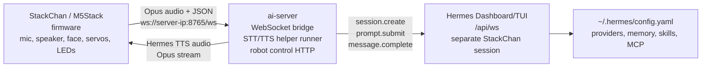
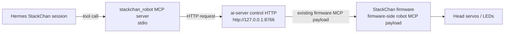

# StackChan Hermes Edition

[日本語版はこちら](./README.ja.md)

This repository is for using StackChan with HermesAgent as its backend.

The M5Stack device handles only the hardware-facing work: microphone input, speaker output, face display, head servos, LEDs, touch, BLE Wi-Fi provisioning, and local autonomous motion. STT, LLM, TTS, memory, skills, and MCP decisions are expected to run on a server terminal. That server terminal runs both HermesAgent and `ai-server`.

## What This Repository Is

- StackChan is the physical interface for HermesAgent.
- `ai-server` is the bridge between the M5Stack WebSocket/Opus protocol and HermesAgent.
- HermesAgent owns STT, LLM, TTS, memory, skills, provider configuration, and MCP configuration.
- StackChan firmware only needs Wi-Fi and a `websocket_url` that points to `ai-server`.
- Intentional robot actions are exposed to Hermes as MCP tools. Autonomous blinking, idle motion, and speaking motion stay in firmware.

This repository assumes operation through HermesAgent. Cloud-related parts from the original M5Stack repository have been removed.

## System Overview



Robot-control tools use a second local path on the server terminal:



The v1 robot tools are:

- `stackchan_get_status`: read safe device status without exposing the full bridge URL or secrets.
- `stackchan_get_head_angles`: read current yaw and pitch.
- `stackchan_set_head_angles`: move the head for deliberate gestures.
- `stackchan_set_led_color`: set the onboard RGB LEDs as a subtle cue.
- `stackchan_power_off`: power off the physical StackChan when explicitly requested.
- `stackchan_take_photo`: capture a still photo from the camera.
- `stackchan_display_image`: preview an image on the screen.
- `stackchan_capture_screen`: capture the current display.
- `stackchan_create_reminder`: create a local relative-duration reminder.
- `stackchan_get_reminders`: list active local reminders.
- `stackchan_stop_reminder`: stop a local reminder by ID.

Hermes should call movement and LED tools only for deliberate actions. Firmware still owns natural movement such as blinking, idle animation, speaking-time motion, and local reminder notifications. Camera, screen capture, image preview, and reminder tools are local-only helpers for the StackChan session.
On-device face detection based head tracking is available as an opt-in firmware feature. It is disabled by default and the MVP runs only while Hermes is in STANDBY.

## Repository Layout

- `firmware/`: ESP32-S3 firmware for StackChan hardware.
- `ai-server/`: TypeScript bridge between StackChan and HermesAgent.
- `hermes-agent/`: HermesAgent checkout used by the local setup.
- `remote/`: ESP-NOW remote-controller firmware.
- `app/`: Flutter app. It can still be useful as a BLE Wi-Fi provisioning client, but it is not required for the Hermes voice loop.
- `server/`: Go backend from the broader product stack. It is not required for the local Hermes voice loop.

## Desktop UI Simulator

The firmware avatar UI can be checked on a desktop before flashing an M5Stack. The simulator is a standalone CMake project under `firmware/tools/ui_sim/`; it reuses the LVGL `DefaultAvatar`, `BreathModifier`, and `BlinkModifier`, but does not link production HAL, LCD, touch, servo, audio, camera, PMIC, or ESP-IDF initialization code.

The maintained target is currently macOS. Headless mode is intentionally SDL-free and should be portable to other Unix-like environments with CMake and a C++ compiler, but non-macOS desktop runs are not yet treated as supported release paths.

Quick smoke test:

```bash
./scripts/run-ui-sim.sh --headless \
  --scenario firmware/tools/ui_sim/scenarios/avatar_smoke.json \
  --screenshot /tmp/stackchan-ui-smoke.ppm
```

Check the HERMES app launch handoff and assert that the avatar face is actually drawn after stale Launcher/HERMES fragments are cleared:

```bash
./scripts/run-ui-sim.sh --headless \
  --scenario firmware/tools/ui_sim/scenarios/hermes_app_launch_regression.json \
  --screenshot /tmp/stackchan-ui-hermes-launch.ppm
```

Open a visible 320x240 simulator window on a Mac with SDL2 available:

```bash
./scripts/run-ui-sim.sh --scenario firmware/tools/ui_sim/scenarios/avatar_smoke.json
```

The simulator also has headless regression scenarios for preview overlays, notifications, app-not-ready screens, status/chat/emotion transitions, lifecycle resets, and overlay stacking. Scenario assertions can catch black screens, missing face pixels, stale launcher fragments, off-surface bounding boxes, and overlay visibility regressions.

The scripts do not run `sudo`, `brew install`, global `pip install`, global npm installs, or shell profile edits. Build output and fallback dependencies stay under `firmware/tools/ui_sim/build*` and `firmware/tools/ui_sim/.deps`.

See `firmware/tools/ui_sim/README.md` for dependency details, PPM screenshot notes, troubleshooting, and hardware-only checks.

## Required Server Terminal

Use a PC or server on the same LAN as StackChan. The M5Stack must be able to reach this machine by LAN IP address.

Required on the server terminal:

- Node.js and npm for `ai-server`
- Python 3 for HermesAgent helper modules
- `ffmpeg` for audio conversion when the TTS helper returns non-WAV audio
- HermesAgent installed or available from this repository
- Network access from StackChan to `ws://<server-ip>:8765/ws`

Ports used by the default setup:

| Port | Bind address | Purpose |
| --- | --- | --- |
| `8765` | server LAN interface | StackChan firmware connects here by WebSocket |
| `8766` | `127.0.0.1` | local robot control HTTP used by the MCP server |
| `9119` | `127.0.0.1` | Hermes Dashboard/TUI `/api/ws` |

## Quick Start

### 1. Start Hermes Dashboard/TUI

Run Hermes on the same server terminal where `ai-server` will run:

```bash
hermes dashboard --tui --host 127.0.0.1 --port 9119
```

Hermes must expose Dashboard `/api/ws`. `ai-server` connects to this endpoint, creates a separate StackChan session, and does not reuse or interrupt the Dashboard's active chat session.

### 2. Configure `ai-server`

Create `ai-server/.env`:

```env
PORT=8765
STACKCHAN_CONTROL_PORT=8766
STACKCHAN_CONTROL_HOST=127.0.0.1
STACKCHAN_LOCAL_ONLY=true

HERMES_CONNECT_MODE=dashboard_ws
HERMES_DASHBOARD_URL=http://127.0.0.1:9119
HERMES_ROOT=../hermes-agent
HERMES_PYTHON=python3
HERMES_LOCAL_STT_LANGUAGE=ja

STACKCHAN_SILENCE_TIMEOUT_MS=1200
STACKCHAN_MAX_RECORDING_MS=15000
STACKCHAN_MIN_FRAMES_FOR_STT=10
STACKCHAN_POST_TTS_COOLDOWN_MS=1500
STACKCHAN_LOCAL_VAD_ENABLED=true
STACKCHAN_VAD_RMS_THRESHOLD=0.012
STACKCHAN_VAD_START_SPEECH_MS=120
STACKCHAN_VAD_END_SILENCE_MS=900
STACKCHAN_VAD_MIN_SPEECH_MS=240
STACKCHAN_VAD_PREROLL_MS=300
```

`HERMES_ROOT` must point to the HermesAgent source tree or installed module root that contains the Python tools used by the STT/TTS helpers.
Local VAD is enabled by default. It is a lightweight RMS-based detector that runs inside `ai-server` after Opus is decoded to 16 kHz mono PCM, so it can end a turn even when the device keeps sending silent Opus frames. For noisy rooms, raise `STACKCHAN_VAD_RMS_THRESHOLD`. If the end of speech is clipped, raise `STACKCHAN_VAD_END_SILENCE_MS`; if replies feel slow, lower it. `STACKCHAN_VAD_START_SPEECH_MS` and `STACKCHAN_VAD_PREROLL_MS` tune start stability and head padding.

Set `STACKCHAN_LOCAL_ONLY=true` to keep the StackChan voice loop local-only. In that mode `HERMES_DASHBOARD_URL` must point to `localhost`, `127.0.0.1`, `::1`, or `host.docker.internal`, and the Hermes STT/TTS helpers refuse cloud fallback. Use faster-whisper or `HERMES_LOCAL_STT_COMMAND` for STT, and use Piper, KittenTTS, NeuTTS, or a command TTS provider for speech. First-time model downloads and package installs may still be part of setup, but runtime does not escape to cloud STT/TTS APIs.

Build and run:

```bash
cd ai-server
npm install
npm run build
npm start
```

The bridge listens for StackChan at:

```text
ws://<server-ip>:8765/ws
```

Reference setting string: `websocket_url: ws://<server-ip>:8765/ws`

### 3. Configure Hermes MCP Robot Tools

Add the StackChan robot MCP server to `~/.hermes/config.yaml`:

```yaml
mcp_servers:
  stackchan_robot:
    command: node
    args:
      - /absolute/path/to/StackChan/ai-server/dist/stackchan_mcp_server.js
    env:
      STACKCHAN_CONTROL_URL: http://127.0.0.1:8766
```

Restart Hermes after changing the config. The MCP server talks only to the local `ai-server` control HTTP endpoint. If StackChan is not connected, the tool result reports a clear device-not-connected error instead of crashing the Hermes conversation.

### 4. Configure the StackChan SD Card

Create `/sdcard/config.json` on the StackChan SD card:
An example is available at `firmware/sdcard/config.sample.json`.

```json
{
  "websocket_url": "ws://<server-ip>:8765/ws",
  "websocket_version": 3,
  "face_tracking_enabled": false,
  "face_tracking_hz": 2,
  "face_tracking_mode": "standby",
  "wifi_ssid": "YOUR_2_4GHZ_WIFI_SSID",
  "wifi_password": "YOUR_WIFI_PASSWORD"
}
```

Use the server terminal's LAN IP address. `wifi_ssid` and `wifi_password` are optional; when present, `Load SD Config` imports them into NVS and marks network setup complete. Use an empty `wifi_password` for an open network.
Set `face_tracking_enabled` to `true` to enable low-rate on-device face detection and head tracking during Hermes standby. `face_tracking_mode` currently accepts `off`, `standby`, `standby_speaking`, or `all`, but the MVP safely tracks only in standby.

The Wi-Fi fields can also be written as a nested object: `"wifi": {"ssid": "...", "password": "..."}`.

### 5. Boot StackChan

On first boot without configuration, the firmware shows `HERMES SETUP`. After the device has Wi-Fi and bridge settings, booting stays on Launcher by default; HERMES does not auto-open unless `CONFIG_HERMES_AUTOSTART=y` is explicitly enabled. Select the `HERMES` app from Launcher to start the Hermes runtime manually.

Expected setup states:

- `Bridge URL missing`: `websocket_url` was not imported from SD/NVS.
- `Wi-Fi not connected`: Wi-Fi provisioning is still needed.
- `Starting Hermes...` / `Connecting to Hermes bridge`: firmware is starting the local WebSocket runtime.
- `Hermes bridge ready`: StackChan is connected through `ai-server`.
- `Check websocket_url and bridge host`: StackChan could not reach the bridge host.

BLE Wi-Fi provisioning remains available, but it is presented as network setup rather than account binding. The setup screen shows the device ID and waits for Wi-Fi credentials from a provisioning client.

## Runtime Behavior

Audio flow:

1. StackChan streams microphone Opus frames to `ai-server`.
2. `ai-server` decodes incoming Opus to PCM and uses local RMS VAD to detect utterance end from audio content.
3. `ai-server` sends the captured PCM as WAV to Hermes STT through Python helper modules.
4. `ai-server` submits the transcript to Hermes Dashboard `/api/ws` using a dedicated StackChan session.
5. Hermes returns the final assistant message from that session.
6. `ai-server` calls Hermes TTS through Python helper modules.
7. `ai-server` streams synthesized Opus audio back to StackChan.

Interrupt behavior:

- StackChan `abort` stops local playback streaming.
- `ai-server` sends `session.interrupt` only for the StackChan Hermes session.
- Existing Dashboard/TUI sessions for other work are not interrupted.

Movement behavior:

- Hermes can intentionally move the head or set LEDs through MCP tools.
- Firmware continues autonomous blinking, idle motion, and speaking motion.
- `ai-server` infers simple StackChan emotions from Hermes replies instead of always sending `neutral`.
- This mixed-control model keeps robot behavior natural without requiring Hermes to micromanage every frame.

## Firmware Setup

The Hermes firmware in this repository keeps only the necessary firmware features and removes cloud-first screens.

Launcher apps:

- `HERMES`
- `DANCE`
- `ESPNOW.REMOTE`
- `SETUP`

Setup keeps:

- Version display
- Wi-Fi and BLE provisioning
- Device information
- Hermes bridge settings
- Hardware test

Build and flash from `firmware/` with ESP-IDF:

```bash
cd firmware
idf.py build
idf.py -p /dev/cu.usbmodemXXXX flash monitor
```

Use the serial port that matches your connected M5Stack.

## Troubleshooting

### Dashboard token or `/api/ws` error

Start Hermes with Dashboard/TUI enabled:

```bash
hermes dashboard --tui --host 127.0.0.1 --port 9119
```

If the Dashboard HTML does not expose a session token, set `HERMES_DASHBOARD_TOKEN` in `ai-server/.env` only if your Hermes setup provides a known token.

### StackChan cannot connect

Check these points:

- `ai-server` is running.
- The M5Stack and server terminal are on the same LAN.
- The SD config uses the server terminal's LAN IP address.
- Firewall rules allow inbound TCP port `8765`.
- The URL ends with `/ws`.

### Hermes replies but the robot tools fail

Check these points:

- `ai-server` control server is listening on `127.0.0.1:8766`.
- Hermes config uses `STACKCHAN_CONTROL_URL=http://127.0.0.1:8766`.
- `npm run build` was run after changing `ai-server`.
- StackChan is connected to `ai-server`.

### STT/TTS helper failure

Check these points:

- `HERMES_ROOT` points to the HermesAgent tree.
- `HERMES_PYTHON` points to the Python interpreter that can import Hermes tool modules.
- `ffmpeg` is installed and available on `PATH`.
- Hermes provider and audio tool configuration are valid in `~/.hermes/config.yaml`.
- With `STACKCHAN_LOCAL_ONLY=true`, STT must be faster-whisper or `local_command`, and TTS must be Piper, KittenTTS, NeuTTS, or a command provider. Edge TTS, OpenAI, Groq, ElevenLabs, MiniMax, xAI, Mistral, and Gemini are not used as fallback.

## Development Checks

Recommended checks after changes:

```bash
cd ai-server
npm run build
npm test
```

```bash
cd firmware
idf.py build
```

README consistency checks:

```bash
rg "HERMES_CONNECT_MODE=dashboard_ws|HERMES_DASHBOARD_URL=http://127.0.0.1:9119|STACKCHAN_CONTROL_URL=http://127.0.0.1:8766|websocket_url: ws://<server-ip>:8765/ws" README.md README.ja.md
```

## Hardware Safety

Do not forcibly rotate motorized parts by hand when you are unsure whether the motors are powered or under control. Doing so can damage the hardware.

Product documentation for the base hardware:

- [English](https://docs.m5stack.com/en/StackChan)
- [日本語](https://docs.m5stack.com/ja/StackChan)
- [中文](https://docs.m5stack.com/zh_CN/StackChan)
