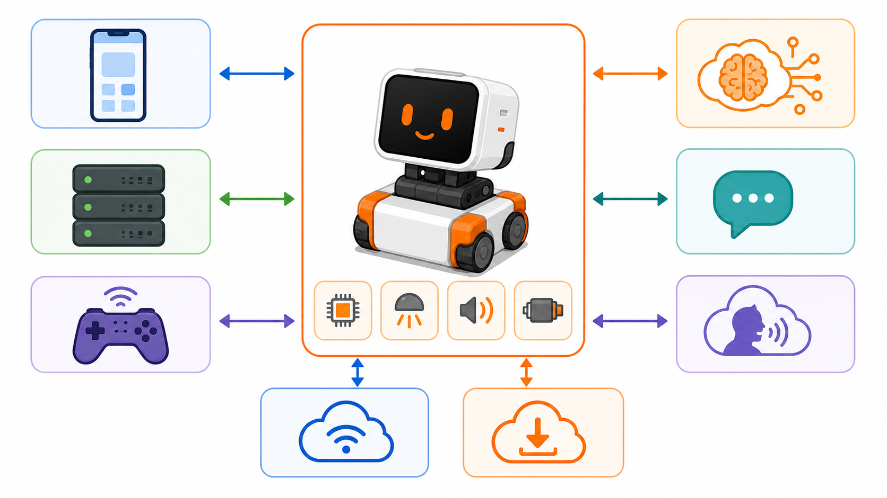

# StackChan Open-Source


Here are StackChan related open-source resources, including source code of the StackChan firmware, remote controller firmware, mobile app (iOS and Android), and server. 

Update of this repo could be a little late than the released firmware and mobile app. 

## Architecture and API Communication



StackChan is organized into five main runtime parts:

- `firmware/`: ESP32-S3 firmware for the robot hardware, including display, camera, audio, motors, BLE setup, ESP-NOW control, OTA, EzData MQTT, and XiaoZhi MCP tools.
- `app/`: Flutter mobile app for iOS and Android. It handles user login, device binding, BLE provisioning, camera/audio/avatar control, and XiaoZhi settings.
- `server/`: GoFrame backend. It exposes REST APIs, WebSocket relay, JWT/MAC authentication, file hosting, admin routes, and XiaoZhi token/license helpers.
- `remote/`: ESP-NOW joystick firmware that sends local wireless control packets to the robot.
- `ai-server/`: Optional local TypeScript voice pipeline that can use OpenAI-compatible chat/STT APIs, Whisper, VoiceVox, and tool calls.

External communication is handled through these paths:

- REST/HTTPS: the Flutter app calls the Go backend under `/stackChan` and `/stackChan/v2`; the app and server also call XiaoZhi APIs such as `https://xiaozhi.me/` and `https://api.xiaozhi.me/`.
- WebSocket: the app and firmware connect to the backend at `/stackChan/ws`; binary messages use a 1-byte type, 4-byte big-endian payload length, and payload body.
- Authentication: app/backend traffic uses an RSA-encrypted `Authorization` value derived from the device MAC, plus a JWT `token` header on v2 app routes.
- BLE, ESP-NOW, and MQTT: the app provisions nearby devices through BLE, the remote controller sends ESP-NOW packets, and the firmware can exchange EzData messages over MQTT.
- OTA and app downloads: firmware retrieves update and app metadata from configured HTTP endpoints.

## Local AI Server

`ai-server/` can run the main voice conversation loop locally: StackChan sends microphone Opus frames over WebSocket, the server runs STT -> LLM -> TTS, and StackChan receives synthesized Opus frames plus small JSON state events. The mobile app and Go backend are not required for this local voice path.

Example local services:

- LLM: Ollama, LM Studio, llama.cpp, or vLLM through an OpenAI-compatible `/v1` endpoint.
- STT: a local Whisper ASR service such as `onerahmet/openai-whisper-asr-webservice`.
- TTS: VOICEVOX Engine.

Example `ai-server/.env`:

```env
OPENAI_API_KEY=local
OPENAI_MODEL=qwen2.5:7b
OPENAI_BASE_URL=http://localhost:11434/v1
STT_BASE_URL=http://localhost:9000
VOICEVOX_URL=http://localhost:50021
VOICEVOX_SPEAKER=1
PORT=8765
```

Example StackChan SD card config at `/sdcard/config.json`:

```json
{
  "websocket_url": "ws://192.168.1.10:8765/ws",
  "websocket_version": 3,
  "openai_base_url": "http://192.168.1.10:11434/v1",
  "openai_model": "qwen2.5:7b",
  "openai_api_key": "local"
}
```

----


**StackChan is a super kawaii AI desktop robot co-created by M5Stack and the user community.** It uses the M5Stack **flagship IoT development kit [CoreS3](https://docs.m5stack.com/en/core/CoreS3)** as its main controller, powered by an ESP32-S3 SoC featuring a 240 MHz dual-core processor, with 16MB Flash and 8MB PSRAM onboard, and supporting Wi-Fi and BLE. The main unit also integrates a 2.0-inch capacitive touch display with a high-strength glass cover, a 0.3 MP camera, a proximity & ambient light sensor, a 9-axis IMU (accelerometer + gyroscope + magnetometer), a microSD card slot, a 1W speaker, dual microphones, and power/reset buttons. 

The **robot body**, connected to the main unit, includes a USB-C interface for power and data, a 550 mAh battery, two feedback servos (360-degree continuous rotation on the horizontal axis and 90-degree movement on the vertical axis), two rows totaling 12 RGB LEDs, infrared transmitter and receiver, a three-zone touch panel, and a full-featured NFC module. 

The **factory firmware** is feature-rich, including an AI Agent, lively and expressive animations, ESP-NOW wireless remote control, and online app downloads. It can connect to a mobile app for video viewing, remote avatar control, and more, and also supports online updates (OTA). The product also supports programming via Arduino, UiFlow2, and other methods, and can connect to various expansion units in the M5Stack ecosystem, making it easy to implement a wide range of custom functions. 

> ⚠️ Do not forcibly rotate any movable parts connected to the motors by hand when you are unsure whether the motors are powered and under control, as this may cause hardware damage. 

- Purchase link: [M5Stack Official Store](https://shop.m5stack.com/products/stackchan-kawaii-co-created-open-source-ai-desktop-robot) | [淘宝 Taobao](https://item.taobao.com/item.htm?id=1042238294510)

- Product document page: [English](https://docs.m5stack.com/en/StackChan) | [日本語](https://docs.m5stack.com/ja/StackChan) | [中文](https://docs.m5stack.com/zh_CN/StackChan)

- Board support package: https://github.com/m5stack/StackChan-BSP

Thank you to the contributors of the StackChan community, especially: 

|  |  |
| -------------------------------------------------------------------------------- | --------------------------------------------------------------------------- |
| [@stack_chan](https://x.com/stack_chan)                                          | [@mongonta555](https://x.com/mongonta555)                                   |
| Shinya Ishikawa                                                                  | Takao Akaki                                                                 |
