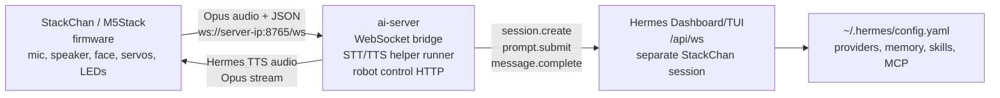
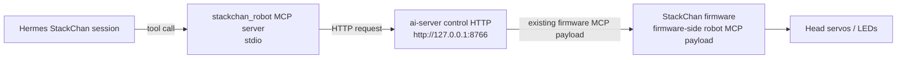

# StackChan Hermes Edition

[日本語版はこちら](./README.ja.md)

This repository is for using StackChan with HermesAgent as its backend.

The M5Stack device handles only the hardware-facing work: microphone input, speaker output, face display, head servos, LEDs, touch, BLE Wi-Fi provisioning, and local autonomous motion. STT, LLM, TTS, memory, skills, and MCP decisions are expected to run on a server terminal. That server terminal runs both HermesAgent and `ai-server`.

## What This Repository Is

- StackChan is the physical interface for HermesAgent.
- `ai-server` is the bridge between the M5Stack WebSocket/Opus protocol and HermesAgent.
- HermesAgent owns STT, LLM, TTS, memory, skills, provider configuration, and MCP configuration.
- StackChan firmware only needs Wi-Fi and a `websocket_url` that points to `ai-server`.
- Intentional robot actions are exposed to Hermes as MCP tools. Autonomous blinking, idle motion, and speaking motion stay in firmware.

This repository assumes operation through HermesAgent. Cloud-related parts from the original M5Stack repository have been removed.

## System Overview


```mermaid
flowchart LR
    M5["StackChan / M5Stack\nfirmware\nmic, speaker, face, servos, LEDs"]
    Bridge["ai-server\nWebSocket bridge\nSTT/TTS helper runner\nrobot control HTTP"]
    Hermes["Hermes Dashboard/TUI\n/api/ws\nseparate StackChan session"]
    Config["~/.hermes/config.yaml\nproviders, memory, skills, MCP"]

    M5 -- "Opus audio + JSON\nws://server-ip:8765/ws" --> Bridge
    Bridge -- "session.create\nprompt.submit\nmessage.complete" --> Hermes
    Hermes --> Config
    Bridge -- "Hermes TTS audio\nOpus stream" --> M5
```

Robot-control tools use a second local path on the server terminal:


```mermaid
flowchart LR
    Hermes["Hermes StackChan session"]
    MCP["stackchan_robot MCP server\nstdio"]
    Control["ai-server control HTTP\nhttp://127.0.0.1:8766"]
    Firmware["StackChan firmware\nfirmware-side robot MCP payload"]
    Body["Head servos / LEDs"]

    Hermes -- "tool call" --> MCP
    MCP -- "HTTP request" --> Control
    Control -- "existing firmware MCP payload" --> Firmware
    Firmware --> Body
```

The v1 robot tools are:

- `stackchan_get_status`: read safe device status without exposing the full bridge URL or secrets.
- `stackchan_set_speaker_volume`: temporarily or permanently set the physical speaker volume.
- `stackchan_play_test_tone`: play a short diagnostic tone directly on the M5 speaker, bypassing Hermes/TTS/Opus.
- `stackchan_get_head_angles`: read current yaw and pitch.
- `stackchan_set_head_angles`: move the head for deliberate gestures.
- `stackchan_set_led_color`: set the onboard RGB LEDs as a subtle cue.
- `stackchan_power_off`: power off the physical StackChan when explicitly requested.
- `stackchan_take_photo`: capture a still photo from the camera.
- `stackchan_display_image`: preview an image on the screen.
- `stackchan_capture_screen`: capture the current display.
- `stackchan_ask_hermes_subagent`: delegate slow research, code review, long reasoning, or tool-heavy work to a background Hermes sub-agent so the foreground agent can answer briefly first.
- `stackchan_create_reminder`: create a local relative-duration reminder.
- `stackchan_get_reminders`: list active local reminders.
- `stackchan_stop_reminder`: stop a local reminder by ID.

Hermes should call movement and LED tools only for deliberate actions. Firmware still owns natural movement such as blinking, idle animation, speaking-time motion, and local reminder notifications. Camera, screen capture, image preview, and reminder tools are local-only helpers for the StackChan session.

## Repository Layout

- `firmware/`: ESP32-S3 firmware for StackChan hardware.
- `ai-server/`: TypeScript bridge between StackChan and HermesAgent.
- `hermes-agent/`: HermesAgent checkout used by the local setup.
- `remote/`: ESP-NOW remote-controller firmware.
- `app/`: Flutter app. It can still be useful as a BLE Wi-Fi provisioning client, but it is not required for the Hermes voice loop.
- `server/`: Go backend from the broader product stack. It is not required for the local Hermes voice loop.

## Desktop UI Simulator

The firmware avatar UI can be checked on a desktop before flashing an M5Stack. The simulator is a standalone CMake project under `firmware/tools/ui_sim/`; it reuses the LVGL `DefaultAvatar`, `BreathModifier`, and `BlinkModifier`, but does not link production HAL, LCD, touch, servo, audio, camera, PMIC, or ESP-IDF initialization code.

The maintained target is currently macOS. Headless mode is intentionally SDL-free and should be portable to other Unix-like environments with CMake and a C++ compiler, but non-macOS desktop runs are not yet treated as supported release paths.

Quick smoke test:

```bash
./scripts/run-ui-sim.sh --headless \
  --scenario firmware/tools/ui_sim/scenarios/avatar_smoke.json \
  --screenshot /tmp/stackchan-ui-smoke.ppm
```

Check the HERMES app launch handoff and assert that the avatar face is actually drawn after stale Launcher/HERMES fragments are cleared:

```bash
./scripts/run-ui-sim.sh --headless \
  --scenario firmware/tools/ui_sim/scenarios/hermes_app_launch_regression.json \
  --screenshot /tmp/stackchan-ui-hermes-launch.ppm
```

Open a visible 320x240 simulator window on a Mac with SDL2 available:

```bash
./scripts/run-ui-sim.sh --scenario firmware/tools/ui_sim/scenarios/avatar_smoke.json
```

The simulator also has headless regression scenarios for preview overlays, notifications, app-not-ready screens, status/chat/emotion transitions, lifecycle resets, and overlay stacking. Scenario assertions can catch black screens, missing face pixels, stale launcher fragments, off-surface bounding boxes, and overlay visibility regressions.

The scripts do not run `sudo`, `brew install`, global `pip install`, global npm installs, or shell profile edits. Build output and fallback dependencies stay under `firmware/tools/ui_sim/build*` and `firmware/tools/ui_sim/.deps`.

See `firmware/tools/ui_sim/README.md` for dependency details, PPM screenshot notes, troubleshooting, and hardware-only checks.

## Required Server Terminal

Use a PC or server on the same LAN as StackChan. The M5Stack must be able to reach this machine by LAN IP address.

Required on the server terminal:

- Node.js and npm for `ai-server`
- Python 3 for HermesAgent helper modules
- `ffmpeg` for audio conversion when the TTS helper returns non-WAV audio
- HermesAgent installed or available from this repository
- Network access from StackChan to `ws://<server-ip>:8765/ws`

Ports used by the default setup:

| Port | Bind address | Purpose |
| --- | --- | --- |
| `8765` | server LAN interface | StackChan firmware connects here by WebSocket |
| `8766` | `127.0.0.1` | local robot control HTTP used by the MCP server |
| `9119` | `127.0.0.1` | Hermes Dashboard/TUI `/api/ws` |

## Quick Start

### 1. Start Hermes Dashboard/TUI

Run Hermes on the same server terminal where `ai-server` will run:

```bash
hermes dashboard --tui --host 127.0.0.1 --port 9119
```

Hermes must expose Dashboard `/api/ws`. `ai-server` connects to this endpoint, creates a separate StackChan session, and does not reuse or interrupt the Dashboard's active chat session.

### 2. Configure `ai-server`

Create `ai-server/.env`:

```env
PORT=8765
STACKCHAN_CONTROL_PORT=8766
STACKCHAN_CONTROL_HOST=127.0.0.1
STACKCHAN_LOCAL_ONLY=true

HERMES_CONNECT_MODE=dashboard_ws
HERMES_DASHBOARD_URL=http://127.0.0.1:9119
STACKCHAN_HERMES_WARMUP_ENABLED=false
STACKCHAN_HERMES_WARMUP_TIMEOUT_MS=20000
HERMES_ROOT=../hermes-agent
HERMES_PYTHON=python3
HERMES_LOCAL_STT_LANGUAGE=ja
STACKCHAN_LOCAL_TTS_URL=http://127.0.0.1:18002/?language=ja
STACKCHAN_LOCAL_TTS_TIMEOUT_MS=15000
STACKCHAN_LOCAL_TTS_OUTPUT_ENABLED=false
STACKCHAN_LOCAL_TTS_OUTPUT_TARGET_NAME=JBL Flip 3
STACKCHAN_LOCAL_TTS_OUTPUT_VOLUME=0.35
STACKCHAN_LOCAL_TTS_FALLBACK_M5_VOLUME=62

STACKCHAN_SILENCE_TIMEOUT_MS=1200
STACKCHAN_MAX_RECORDING_MS=15000
STACKCHAN_MIN_FRAMES_FOR_STT=10
STACKCHAN_POST_TTS_COOLDOWN_MS=1000
STACKCHAN_LOCAL_VAD_ENABLED=true
STACKCHAN_VAD_RMS_THRESHOLD=0.025
STACKCHAN_VAD_START_SPEECH_MS=60
STACKCHAN_VAD_END_SILENCE_MS=650
STACKCHAN_VAD_MIN_SPEECH_MS=240
STACKCHAN_VAD_PREROLL_MS=360
STACKCHAN_BARGE_IN_ENABLED=false
STACKCHAN_BARGE_IN_RMS_THRESHOLD=0.75
STACKCHAN_BARGE_IN_START_SPEECH_MS=360
STACKCHAN_BARGE_IN_MIN_SPEECH_MS=420
STACKCHAN_BARGE_IN_IGNORE_TTS_START_MS=1800
STACKCHAN_MAX_SPEECH_CHARS=28
STACKCHAN_TTS_SEGMENT_MAX_CHARS=28
STACKCHAN_TTS_MAX_SEGMENTS=1
STACKCHAN_TTS_PREROLL_MS=600
STACKCHAN_TTS_OUTPUT_GAIN=0.65
STACKCHAN_OPUS_PCM_INPUT=buffer
STACKCHAN_MAX_DURATION_STT_RMS_THRESHOLD=0.006
STACKCHAN_FAST_ACK_ENABLED=true
STACKCHAN_FAST_ACK_TEXT=はい。
STACKCHAN_FAST_ACK_TEXTS=はい。|うん。|了解。|なるほど。|わかった。|OK。
STACKCHAN_STOP_LLM_AFTER_MAX_SPOKEN_SEGMENTS=true
STACKCHAN_REPLY_PROMPT_PREFIX=音声会話です。原則1文・14文字以内で短く自然に返して。長さ指定が聞こえても、長く話し続けず必要なら「もう一度。」だけ返して。冗長にしない。
STACKCHAN_AUTO_LED_ENABLED=true
STACKCHAN_AUTO_LED_MANUAL_HOLD_MS=8000
```

`HERMES_ROOT` must point to the HermesAgent source tree or installed module root that contains the Python tools used by the STT/TTS helpers. When `STACKCHAN_LOCAL_TTS_URL` is set, `ai-server` posts UTF-8 text directly to that persistent local endpoint and expects a WAV response. This removes the per-segment Hermes/Python helper startup overhead. Piper Plus `piper.http_server` is compatible with this route.
When `STACKCHAN_LOCAL_TTS_OUTPUT_ENABLED=true`, `ai-server` looks up the named PipeWire sink for every TTS turn. If it is available, speech is played on that host speaker while the M5 speaker is temporarily muted; timed Opus frames still reach the M5 for avatar synchronization. If the sink is absent or setup fails, output automatically falls back to the M5 at `STACKCHAN_LOCAL_TTS_FALLBACK_M5_VOLUME`. This is useful when a Bluetooth speaker is placed directly behind StackChan.
On an always-on low-spec host, set `STACKCHAN_HERMES_WARMUP_ENABLED=true` to send one minimal private prompt before the device WebSocket listener opens. This moves the provider cold-start delay to service startup. The wait is bounded by `STACKCHAN_HERMES_WARMUP_TIMEOUT_MS`, and a warmup failure does not prevent `ai-server` from starting.
Local VAD is enabled for the low-latency M5Stack path. Incoming Opus frames are decoded with a disposable per-session decoder; transient decode failures recreate that decoder and only fall back to the arrival-gap timeout after repeated failures, so a single malformed frame no longer poisons the TTS encoder. `STACKCHAN_VAD_END_SILENCE_MS` is the main latency/false-cut tradeoff: 600-750 ms is a practical range for natural Japanese voice turns.

Barge-in stays off by default until the physical acoustic path has been tuned, because the M5 microphone can otherwise hear its own speaker. TTS is synthesized sentence by sentence so longer replies can begin playing from the first sentence instead of waiting for the whole reply to be synthesized. `STACKCHAN_STOP_LLM_AFTER_MAX_SPOKEN_SEGMENTS` interrupts the dedicated Hermes stream once the configured spoken segment limit is reached, so a misheard long-duration request cannot monopolize the voice loop. `STACKCHAN_TTS_PREROLL_MS` sends a silent Opus preroll before the first audible frame to avoid clipping the first syllable on the device speaker; 450-600 ms is a practical range when the device speaker startup clips the beginning. `STACKCHAN_TTS_OUTPUT_GAIN` lowers synthesized PCM before Opus encoding to avoid speaker clipping on the small M5Stack driver. `STACKCHAN_OPUS_PCM_INPUT=buffer` uses the guarded OpusScript heap-copy encoder; `int16` is only intended for hardware A/B diagnosis of the legacy public OpusScript encode path. `STACKCHAN_MAX_DURATION_STT_RMS_THRESHOLD` skips very quiet max-duration fallback captures before STT, preventing silence hallucinations from becoming accidental replies. `STACKCHAN_FAST_ACK_TEXTS` pre-caches multiple short backchannels and randomly chooses one after STT, avoiding the same first word on every turn.

Automatic LED state display is also enabled by default: soft green while listening, amber while thinking, soft blue while speaking, and off when idle. If Hermes explicitly calls `stackchan_set_led_color`, that manual color is held briefly before automatic state updates resume. More background and migration notes are in [docs/robot-bridge-migration.md](./docs/robot-bridge-migration.md).

Set `STACKCHAN_LOCAL_ONLY=true` to keep the StackChan voice loop local-only. In that mode `HERMES_DASHBOARD_URL` must point to `localhost`, `127.0.0.1`, `::1`, or `host.docker.internal`, and the Hermes STT/TTS helpers refuse cloud fallback. Point `HERMES_STT_URL` at a local OpenAI-compatible endpoint such as ReazonSpeech, or use faster-whisper / `HERMES_LOCAL_STT_COMMAND`; use `STACKCHAN_LOCAL_TTS_URL` for Piper Plus or another local WAV endpoint. First-time model downloads and package installs may still be part of setup, but runtime does not escape to cloud STT/TTS APIs.

Before running the hardware JBL-to-M5 voice-loop probe, check the host audio path:

```bash
cd ai-server
npm run probe:voice -- --preflight
```

The preflight verifies bridge readiness, the JBL PipeWire sink, the USB camera microphone source, ALSA `/dev/snd` access, and Bluetooth connection state. Probe recordings and reports are written under `ai-server/probe-runs/`, which is intentionally git-ignored.

Build and run:

```bash
cd ai-server
npm install
npm run build
npm start
```

The bridge listens for StackChan at:

```text
ws://<server-ip>:8765/ws
```

Reference setting string: `websocket_url: ws://<server-ip>:8765/ws`

### 3. Configure Hermes MCP Robot Tools

Add the StackChan robot MCP server to `~/.hermes/config.yaml`:

```yaml
mcp_servers:
  stackchan_robot:
    command: node
    args:
      - /absolute/path/to/StackChan/ai-server/dist/stackchan_mcp_server.js
    env:
      STACKCHAN_CONTROL_URL: http://127.0.0.1:8766
      HERMES_CONNECT_MODE: dashboard_ws
      HERMES_DASHBOARD_URL: http://127.0.0.1:9119
      HERMES_ROOT: /absolute/path/to/hermes-agent
      HERMES_PYTHON: python3
```

Restart Hermes after changing the config. The MCP server talks only to the local `ai-server` control HTTP endpoint. If StackChan is not connected, the tool result reports a clear device-not-connected error instead of crashing the Hermes conversation.

`stackchan_ask_hermes_subagent` is an optional fast-response tool. When the foreground Hermes agent calls it, the tool returns immediately, letting the foreground agent say a short acknowledgement such as “I’ll check that.” When the background Hermes sub-agent finishes, it posts the result to `ai-server` through `/internal/followup`; the active StackChan session then speaks the follow-up when it is idle. Prefer `HERMES_CONNECT_MODE: dashboard_ws` so sub-agent work connects to the existing Hermes Dashboard instead of spawning extra gateway processes.

### 4. Configure the StackChan SD Card

Create `/sdcard/config.json` on the StackChan SD card:
An example is available at `firmware/sdcard/config.sample.json`.

```json
{
  "websocket_url": "ws://<server-ip>:8765/ws",
  "websocket_version": 3,
  "wifi_ssid": "YOUR_2_4GHZ_WIFI_SSID",
  "wifi_password": "YOUR_WIFI_PASSWORD"
}
```

Use the server terminal's LAN IP address. `wifi_ssid` and `wifi_password` are optional; when present, `Load SD Config` imports them into NVS and marks network setup complete. Use an empty `wifi_password` for an open network.

Changing `config.json` on the SD card by itself does not update the active firmware settings. To change the `ai-server` destination, edit `websocket_url`, then run `SETUP` > `Hermes` > `Load SD Config` again and wait for the two automatic restarts. A valid `ws://` or `wss://` `websocket_url` overwrites the stored NVS WebSocket URL; an empty, missing, invalid, or too-long value is skipped and the previous stored URL remains active.

The firmware does not auto-import SD config at normal boot or when opening HERMES. On CoreS3 / StackChan, the SD card and LCD share SPI/GPIO35, so SD import is limited to the explicit `SETUP` > `Hermes` > `Load SD Config` flow. That flow reboots first, imports the SD config before LCD initialization, then reboots again into normal startup.

The Wi-Fi fields can also be written as a nested object: `"wifi": {"ssid": "...", "password": "..."}`.

### 5. Boot StackChan

On first boot without configuration, the firmware shows `HERMES SETUP`. If you use SD configuration, skip to Launcher and run `SETUP` > `Hermes` > `Load SD Config` once before opening HERMES; wait for both automatic restarts to finish. After the device has Wi-Fi and bridge settings, booting stays on Launcher by default; HERMES does not auto-open unless `CONFIG_HERMES_AUTOSTART=y` is explicitly enabled. Select the `HERMES` app from Launcher to start the Hermes runtime manually.

In Mooncake apps, including a HERMES not-ready screen, swipe up from the bottom edge to show the Home button, then tap it to return to Launcher. After the Hermes runtime has started, the same bottom-edge swipe shows the Home button; tapping it reboots the device back to Launcher because Mooncake has already been torn down.

Expected setup states:

- `Bridge URL missing`: `websocket_url` is not in NVS; use `Load SD Config` or another setup path.
- `Wi-Fi not connected`: Wi-Fi provisioning is still needed.
- `Starting Hermes...` / `Connecting to Hermes bridge`: firmware is starting the local WebSocket runtime.
- `Hermes bridge ready`: StackChan is connected through `ai-server`.
- `Check websocket_url and bridge host`: StackChan could not reach the bridge host.

After HERMES has been opened manually, an unexpected WebSocket disconnect is retried automatically with a 1, 2, 4, ... 30 second capped backoff. An intentional close, returning to Launcher, or resetting the protocol cancels the retry. This lets StackChan recover after an `ai-server` restart without rebooting the device or reopening HERMES.

BLE Wi-Fi provisioning remains available, but it is presented as network setup rather than account binding. The setup screen shows the device ID and waits for Wi-Fi credentials from a provisioning client.

## Runtime Behavior

Audio flow:

1. StackChan streams microphone Opus frames to `ai-server`.
2. `ai-server` decodes incoming Opus to PCM and uses local RMS VAD to detect utterance end from audio content.
3. `ai-server` sends the captured PCM as WAV directly to the configured OpenAI-compatible local STT endpoint. If no endpoint is configured, it falls back to the Hermes Python helper.
4. `ai-server` submits the transcript to Hermes Dashboard `/api/ws` using a dedicated StackChan session.
5. Hermes returns the final assistant message from that session.
6. `ai-server` splits the speech text into sentence-sized TTS segments and posts each segment directly to the configured persistent local TTS endpoint. If no endpoint is configured, it falls back to the Hermes Python helper.
7. `ai-server` streams each synthesized Opus segment back to StackChan in order. With optional local TTS output enabled, the named PipeWire speaker carries the audible voice while the same timed stream keeps the M5 avatar synchronized; an unavailable local sink falls back to the M5 speaker.

Interrupt behavior:

- StackChan `abort` stops local playback streaming.
- During TTS streaming, incoming microphone Opus frames are decoded with a stricter barge-in VAD; sustained user speech stops the current TTS stream and interrupts only the StackChan Hermes session.
- Barge-in depends on firmware delivering mic frames during TTS playback. If the firmware suppresses mic input while speaking, no server-side barge-in event can be detected; current xiaozhi speaking-state code should be verified on hardware for the selected listening/AEC mode.
- `ai-server` sends `session.interrupt` only for the StackChan Hermes session.
- Existing Dashboard/TUI sessions for other work are not interrupted.

Movement behavior:

- Hermes can intentionally move the head or set LEDs through MCP tools.
- Firmware continues autonomous blinking, idle motion, and speaking motion.
- Idle movement levels are `Off`, `Calm`, `Natural`, and `Lively`; `Natural` is the default and uses small 6-12 second gaze shifts.
- Firmware also applies small state poses: facing forward while listening, subtle speaking motion during TTS, and a relaxed return to center on standby.
- `ai-server` infers simple StackChan emotions from Hermes replies instead of always sending `neutral`.
- `ai-server` sets subtle automatic LED colors for listening, thinking, speaking, and idle; explicit Hermes LED tool calls temporarily take priority.
- This mixed-control model keeps robot behavior natural without requiring Hermes to micromanage every frame.

## Firmware Setup

The Hermes firmware in this repository keeps only the necessary firmware features and removes cloud-first screens.

Launcher apps:

- `HERMES`
- `DANCE`
- `ESPNOW.REMOTE`
- `SETUP`

Setup keeps:

- Version display
- Wi-Fi and BLE provisioning
- Device information
- Hermes bridge settings
- Hardware test

Build and flash from `firmware/` with ESP-IDF:

```bash
cd firmware
idf.py build
idf.py -p /dev/cu.usbmodemXXXX flash monitor
```

Use the serial port that matches your connected M5Stack.

## Troubleshooting

### Dashboard token or `/api/ws` error

Start Hermes with Dashboard/TUI enabled:

```bash
hermes dashboard --tui --host 127.0.0.1 --port 9119
```

If the Dashboard HTML does not expose a session token, set `HERMES_DASHBOARD_TOKEN` in `ai-server/.env` only if your Hermes setup provides a known token.

### StackChan cannot connect

Check these points:

- `ai-server` is running.
- The M5Stack and server terminal are on the same LAN.
- The SD config uses the server terminal's LAN IP address.
- Firewall rules allow inbound TCP port `8765`.
- The URL ends with `/ws`.

If an already-running HERMES session loses the bridge, leave it open: firmware retries automatically with exponential backoff. Restarting `ai-server` should reconnect within about 1-2 seconds on the first retry; repeated failures back off to at most 30 seconds.

### Hermes replies but the robot tools fail

Check these points:

- `ai-server` control server is listening on `127.0.0.1:8766`.
- Hermes config uses `STACKCHAN_CONTROL_URL=http://127.0.0.1:8766`.
- `npm run build` was run after changing `ai-server`.
- StackChan is connected to `ai-server`.

### STT/TTS helper failure

Check these points:

- `HERMES_ROOT` points to the HermesAgent tree.
- `HERMES_PYTHON` points to the Python interpreter that can import Hermes tool modules.
- `ffmpeg` is installed and available on `PATH`.
- Hermes provider and audio tool configuration are valid in `~/.hermes/config.yaml`.
- With `STACKCHAN_LOCAL_ONLY=true`, STT must use a local `HERMES_STT_URL`, faster-whisper, or `local_command`, and TTS must use `STACKCHAN_LOCAL_TTS_URL`, Piper, KittenTTS, NeuTTS, or a command provider. Edge TTS, OpenAI, Groq, ElevenLabs, MiniMax, xAI, Mistral, and Gemini are not used as fallback.

## Development Checks

Recommended checks after changes:

```bash
cd ai-server
npm run build
npm test
```

```bash
cd firmware
idf.py build
```

README consistency checks:

```bash
rg "HERMES_CONNECT_MODE=dashboard_ws|HERMES_DASHBOARD_URL=http://127.0.0.1:9119|STACKCHAN_CONTROL_URL=http://127.0.0.1:8766|websocket_url: ws://<server-ip>:8765/ws" README.md README.ja.md
```

## Hardware Safety

Do not forcibly rotate motorized parts by hand when you are unsure whether the motors are powered or under control. Doing so can damage the hardware.

Product documentation for the base hardware:

- [English](https://docs.m5stack.com/en/StackChan)
- [日本語](https://docs.m5stack.com/ja/StackChan)
- [中文](https://docs.m5stack.com/zh_CN/StackChan)
